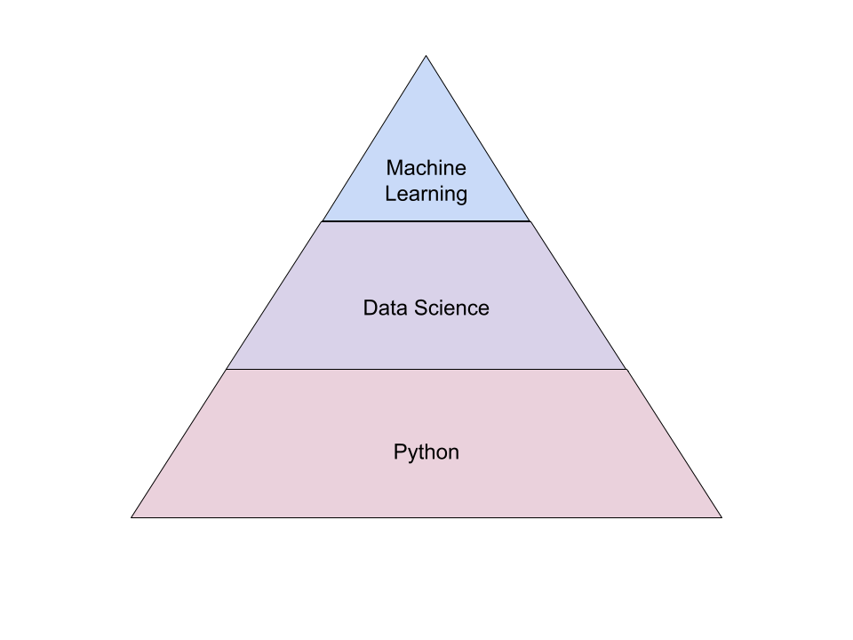
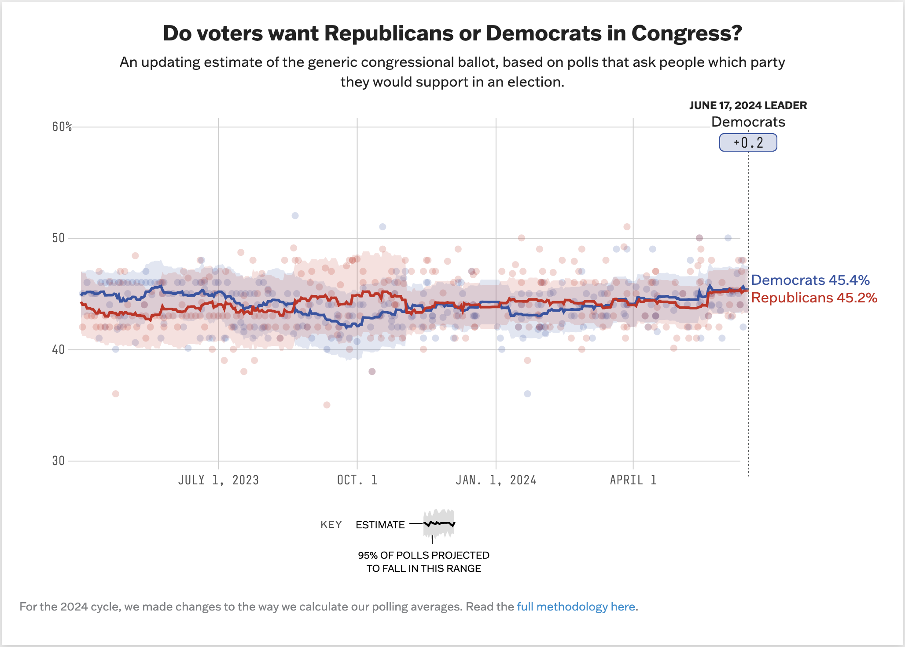
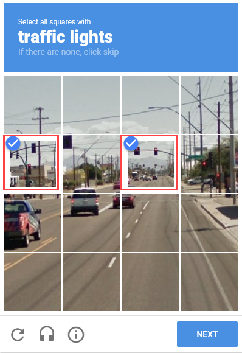
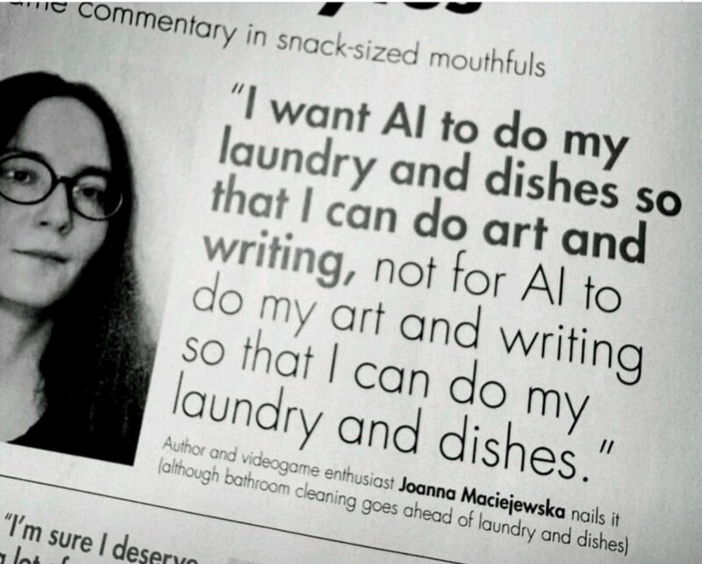
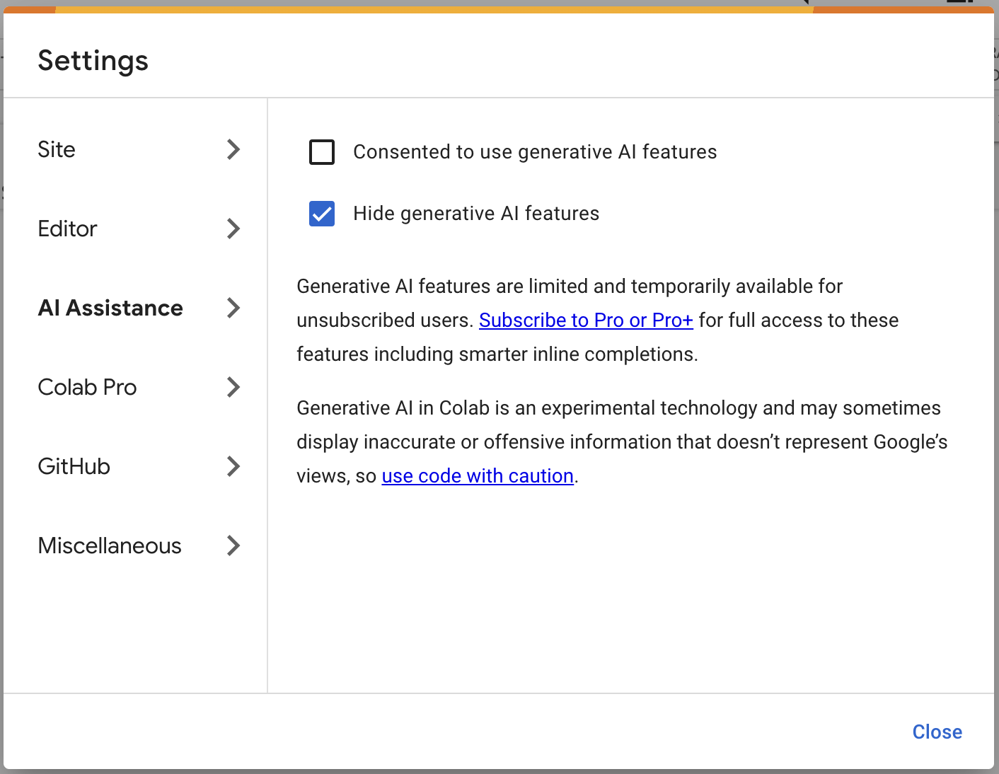
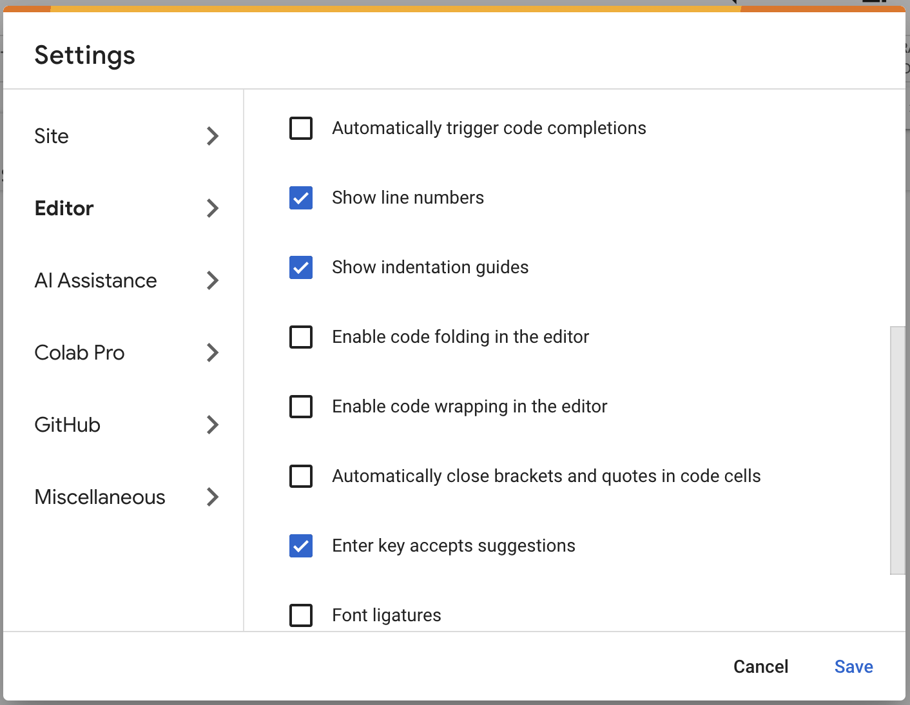

<!-- _class: lead invert -->

# Data Science & Machine Learning 1
Instructor: **Devon Peticolas**
Room: 825 Mudd

---

## Who Am I?

- Mr. Peticolas ("Mr. P").
- I've worked at startups on Data Science teams for 11 years.
- I'm currently at [Oden Technologies](https://oden.io/) where I build and deploy Data Science and Machine Learning for plastics manufacturing.
- This is my **first time** teaching at Columbia.

---

<!-- _class: lead invert -->
<!-- header: What is this Class About -->

# What Is This Class About?

---

### Python
A general-purpose programming language popular in Data Science.

### Data Science
The process of extracting knowledge from data.

### Machine Learning
A subset of Data Science that uses algorithms to learn from data.

---



### Machine Learning
is an application of Data Science.

### Python
is a programming language.

### Data Science
is most often done in Python.

---

<!-- _class: lead invert -->
<!-- header: Why Take This Class? -->

# Why Take This Class?

---

<!-- _class: lead -->

### Python is a Powerful General Purpose Language


https://github.com/kitao/pyxel

---

<!-- _class: lead -->

### Data Science Helps You Make Sense of the World





https://projects.fivethirtyeight.com/polls/generic-ballot/2024/


---

> There are three kinds of lies: lies, damned lies, and statistics.
**~ Benjamin Disraeli**, polularized by Mark Twain

---

<!-- _class: lead -->

### Machine Learning is Sneaking Into Day-to-Day Life



---

### Machine Learning is Sneaking Into Day-to-Day Life


---




---

<!-- _class: lead -->

# The Most Effective Data Scientsts
# Are Not "Real" Data Scientists

---

## Fields That Use Data Science

<div class="columns">

  <div>

- Manufacturing
- Finance
- Molecular Biology
- Healthcare
- Human Resources
- Operations and Supply Chain
- Journalism (538)

</div>

<div>

- Education
- Legal Services
- Sales
- Real Estate
- Environmental Science
- Marine Biology 
- Government and Public Policy

</div>

</div>

---

<!-- _class: lead -->

> I’m a mediocre cartoonist, a mediocre writer, and a mediocre businessperson. But I’m a combination of all three, and the intersection of mediocrity makes me successful.


---

<!-- _class: lead -->

> Programming as a profession is only moderately interesting. It can be a good job, but if you want to make about the same money and be happier you could actually just go run a fast food joint. You are much better off using code as your secret weapon in another profession.
**~ Zed Shaw (Learn Python the Hard Way)**

---

<!-- _class: lead invert -->
<!-- header: Course Objectives and Syllabus -->

# Course Objectives and Syllabus

---

## Course Objectives

1) Produce basic Python programs capable of user input/output.
2) Use data from CSVs, relational databases, and the web in code.
3) Employ Data Science packages to perform adhoc data analysis.
4) Calculate, plot, and present analsysis from data with Python.
5) Model problems with Supervised and Unsupervised ML.
6) Identify the use of neural nets in modern AI.

---


## Week 1: Python

- Introduction to Python and programming (no prior experience)
- Variables, data types, and control flow
- Functions, data structures, and file I/O
- Classes and objects
- Libraries and modules
- Pandas and working with tabular data

---

## Week 2: Data Science

- What is Data?
- Data Formats
- Data Visualization
- Time Series Data
- Natural Language Processing

---

## Week 3: Machine Learning
- Introduction to Machine Learning
- Supervised and Unsupervised Learning
- Neural Networks
- Deep Learning
- How these tools forms the basis of modern AI

---

## Assignments

- Basic Python Exercises in Google Colab Notebooks
- Building a Text Adventure Game
- CSV Data Analysis
- Natural Language Processing with Music Lyrics
- Time Series Data Analysis
- Image Classification with Pytorch

---

<!-- _class: lead -->
<!-- header: "" -->

# Let's Collect Some Data
# http://gg.gg/1b6u3t

---

<!-- _class: lead invert -->
<!-- header: What Tools Will We Use -->

# What Tools Will We Use?

---

- We will use **computers with keyboards**.
- All python will be written in **Jupyter Notebooks**.
- We will use **Google Colab** for running Jupyter notebooks.
    - Online platform for running Jupyter notebooks.
    - Free access to computing resources.
    - Integrates with Google Drive and Github.
- We will share data on Google Drive

---

# About Using ChatGPT, Gemini, etc.
I encourage you to use **all** of the tools at your disposal to learn.

**However**, for many portions of this class, you will be hindering yourself by using these. For the first few lectures, **turn them off** and figure it out on your own.

You will learn more and be better prepared to use (and debug) them in the future.

I will tell you when it's time to turn them on.

---

<!-- _class: lead -->

# http://gg.gg/1b6ui3

Our First Colab Notebook

---

<!-- _class: lead -->

<marquee><h3>NO AUTOCOMPLETE</h3></marquee>

<div class="columns">





</div>

<marquee direction="right"><h3>NO AUTOCOMPLETE</h3></marquee>

---

## Your First Exercise

1. Set up Google Colab and create a new notebook.
2. Write a program that prints "Hello, World!"
   ```python
   print("Hello, World!")
   ```
3. Do some math
   ```python
   print("What is 3 + 4?", 3 + 2)
   print("What is 6 - 7?", 6 - 7)
   print("Is it true that 3 + 4 < 6 - 7?", 3 + 4 < 6 - 7)
   ```
