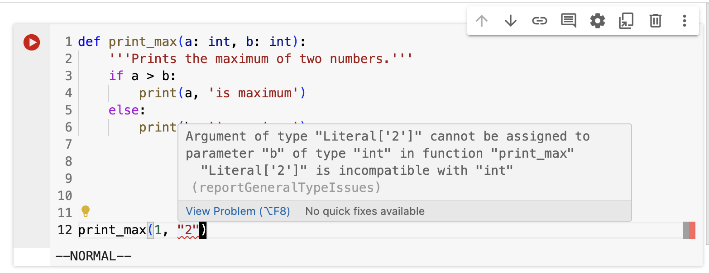

<!-- _class: lead invert -->
<!-- header: Python Functions -->

# Python Functions

---

Functions are reusable pieces of programs. They allow you to give a name to a block of statements, then you can run that block using the specified name anywhere in your program and any number of times.

---

## You're Already Using Functions!

```py
>> print('Hello, world!')
None

>> input("Enter your name: ")
None

>> int("42")
42

>> randint(1, 10)
7
```

---

## Defining a Function

- Use the `def` keyword followed by the function name and parentheses.
- Example:
  ```py
  def say_hello():
      print('Hello, world!')
  ```

---

## Function Arguments

You can provide arguments to a function, which act as inputs.
```py
def print_max(a, b):
    if a > b:
        print(a, 'is maximum')
    else:
        print(b, 'is maximum')
```

Call the function with arguments:
```py
print_max(3, 4)
```

---

## The `return` Statement

The `return` statement is used to return a value from a function.
```py
def maximum(x, y):
    if x > y:
        return x
    else:
        return y
```

Call the function
```py
print(maximum(2, 3))
```

---

<!-- TODO: This exercise was hard to implement in class. Come up with something better next time. -->

# Exercise

Go back to your Calculator program from the beginning of class and refactor it to use functions.

The function arguments should be the two numbers and the operation to perform.

---

## Keyword Arguments

- **Positional Arguments**: The order of arguments is important.
  ```py
  print_max(3, 4)
  ```
- **Keyword Arguments**: The order of arguments is not important.
  ```py
  print_max(b=3, a=4)
  ```

---

## Default Arguments

- **Keyword Default Arguments**: Keyword arguments can have default values.
  ```py
  def say(message, times=1):
      print(message * times)

  say('Hello')    # => 'Hello'
  say('World', 5) # => 'WorldWorldWorldWorldWorld'
  ```

---

## Local Variables

Variables defined within a function are local to that function.
```py
def func(x):
    print('x is', x)
    x = 2
    print('Changed local x to', x)
```

Call the function:
```py
x = 50
func(x)
print('x is still', x)
```

---

## Recursion

A function can call itself. This is known as recursion.
```py
def factorial(n):
    if n == 1:
        return 1
    else:
        return n * factorial(n - 1)
```

---

## Docstrings

You can add documentation to functions using docstrings.
```py
def print_max(a, b):
    """
    Prints the maximum of two numbers.
    """
    a = int(a)  # Convert to integers, if possible
    b = int(b)
    if a > b:
        print(a, 'is maximum')
    else:
        print(b, 'is maximum')
```

---

## Accessing Docstrings

```py
>>> print(print_max.__doc__)
Prints the maximum of two numbers.

>>> help(print_max)
print_max(a, b)
    Prints the maximum of two numbers.
```

---

## Type Hints

<!-- TODO: We should just skip this -->

*These are unecessary but nice to have, especially in Google Colab.*

```py
def print_max(a: int, b: int):
    '''Prints the maximum of two numbers.'''
    if a > b:
        print(a, 'is maximum')
    else:
        print(b, 'is maximum')

print_max(3, "4") # Incorrect type!!!
```

---

<!-- _class: lead -->



---

## Summary

- Functions are reusable blocks of code.
- Use `def` to define functions.
- Functions can have parameters and return values.
- Local variables are confined to the function scope.
- Document your functions with docstrings for better readability.

---

<!-- TODO: This was WAAAAY too hard for a first assignment. Should have started with is_prime or literally anything else. -->

## Exercise
## http://gg.gg/1b81yy