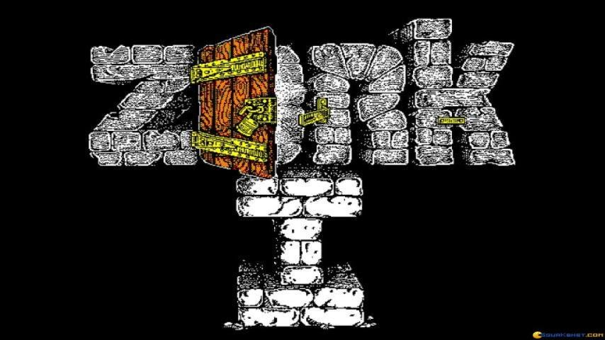

<!-- header: Zork -->

---

## Origins

- **Created by**: Tim Anderson, Marc Blank, Bruce Daniels, Dave Lebling
- **First Appeared**: June 1977
- **Commercial Release**: December 1980
- **Language**: MDL
- **Platform**: PDP-10

---

## The Beginning

- Inspired by the game Adventure
- Developed by four friends from MIT's Dynamic Modeling Group
- Original name: "Dungeon"
- Created as a response to Adventure's popularity and limitations

---

## Gameplay

- Players explore a vast underground world
- Collect treasures and solve puzzles
- Infamous for challenging puzzles and complex commands

---

## Popularity

- Became a must-buy for early computer owners
- Bestselling game in 1982 and 1983
- Covered by major publications like Time
- American astronaut Sally Ride was reportedly obsessed with it

---

## Innovations

- Massively improved interface over Adnventure (much more complex actions)
- Introduced "grues", creatures lurking in the dark
- Sophisticated NPCs like the thief, who roams and interacts with the environment
- Continually updated and improved through player feedback

---

<!-- _class: lead -->

# Let's Play!

# http://gg.gg/1b82by

---

<!-- _class: lead -->

# Exercise
# http://gg.gg/1b82np
