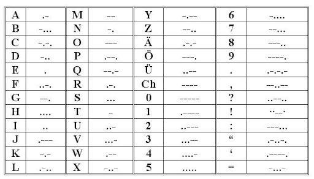
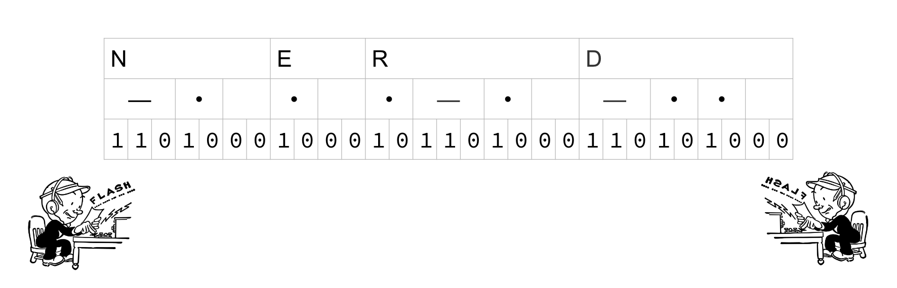
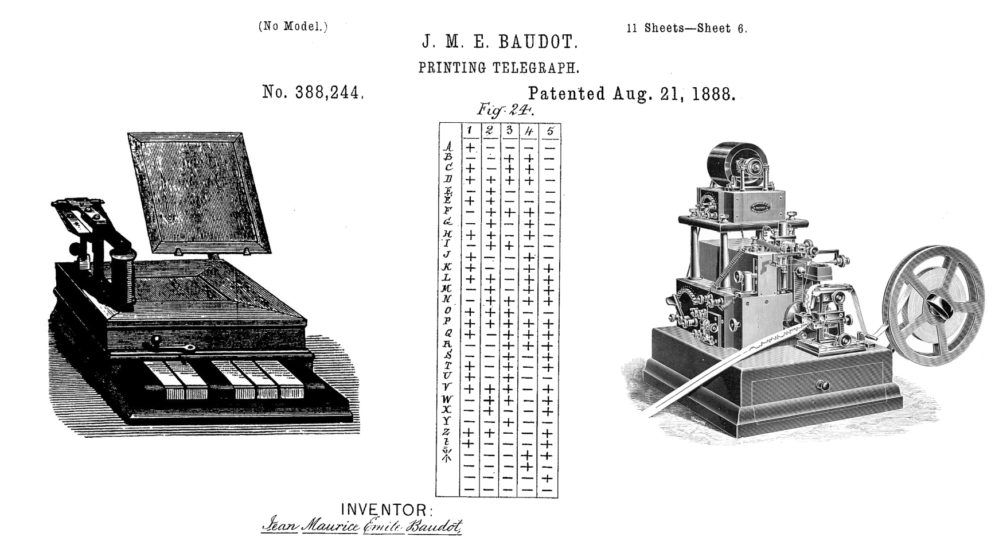
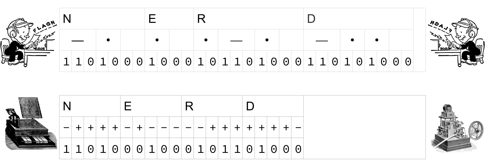
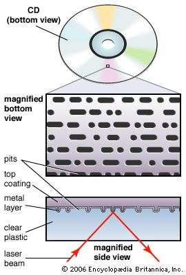
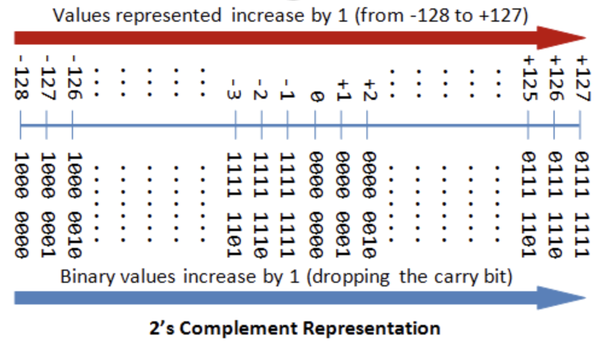
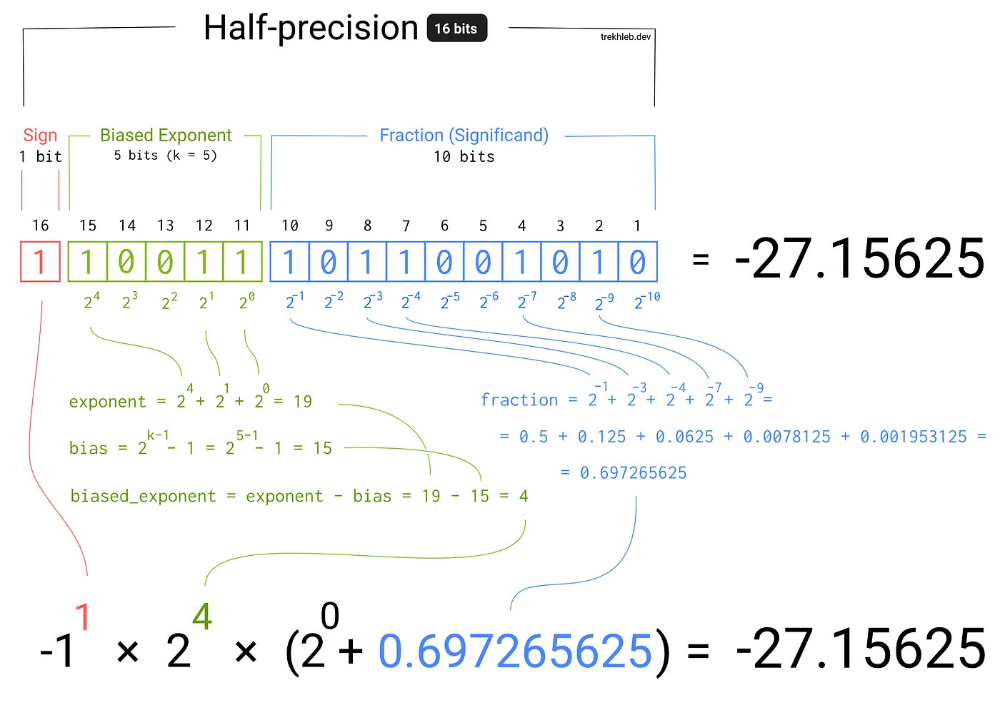

<!-- _class lead -->

# Warm Up Exercise

As a warm-up, write a function `is_prime` that takes an integer `n` and returns `True` if `n` is prime and `False` otherwise.

```py
def is_prime(n):
  if n < 2:
    return False
  ...

#=> is_prime(1)  == False
#=> is_prime(2)  == True
#=> is_prime(6)  == False
#=> is_prime(73) == True
```


---

<!-- _class: lead invert -->
<!-- header: What is Data -->

<!-- _class: lead -->

# What is Data?
(some fun history)

---

<!-- _class: lead -->

## The First Electronic Data




---

<!-- _class: lead -->



---
<!-- _class: lead -->




---



---



---


---

* Morse Code
  - "tomorrow will be better"
  - "--- -- --- .-. .-. --- .-- .-- .. .-.. .-.. -... . -... . - - . .-."
  - 140-ish bits

* Chinese Telegraph Code
  - "明天会更好"
  - ". .-- - . .-. -- --- .-- --. .-. .... .-."
  - 86-ish bits

---

<!-- _class: lead invert -->
<!-- header: Data Primitives -->

# Data Primitives

---


## Data Primitives

- Integers: `5`, `-2`, `4000237`
- Floats: `3.14`, `2.71`
- Characters: `'a'`, `'b'`
- Boolean: `True`, `False`

*A "primitive" data type takes up a small fixed amount of space.*

---

## Integers

| Decimal |  Binary    |
|:-------:|:----------:|
|    0    |  00000000  |
|    1    |  00000001  |
|    2    |  00000010  |
|    3    |  00000011  |
|   ...   |  ...       |
|   254   |  01111110  |
|   255   |  01111111  |

---



---

| 1 byte  | 8 bits  | −128 to +127                                             |
|---------|---------|----------------------------------------------------------|
| 2 bytes | 16 bits | −32,768 to +32,767                                       |
| 4 bytes | 32 bits | −2,147,483,648 to +2,147,483,647                         |
| 8 bytes | 64 bits | −9,223,372,036,854,775,808 to +9,223,372,036,854,775,807 |

---


---
### Floats



---

### Characters (ASCII)
Characters are just numbers!

| Char   | Number | Binary   |
|:------:|:------:|:--------:|
|    A   |   65   | 01000001 |
|    B   |   66   | 01000010 |
|   ...  |  ...   |  ...     |
|    Z   |   90   | 01011010 |
|    a   |   97   | 01100001 |
|    b   |   98   | 01100010 |

---

### Booleans
Bools are also just numbers!

| Bool   | Number | Binary   |
|:------:|:------:|:--------:|
| False  |   0    | 00000000 |
| True   |   1    | 00000001 |

---

## Converting Between Primitives

```py
>>> ord('a')
97
>>> int(True)
1
>>> chr(65)
'A'
>>> bool(0)
False
```