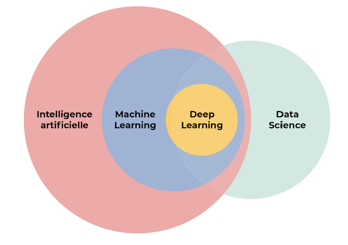
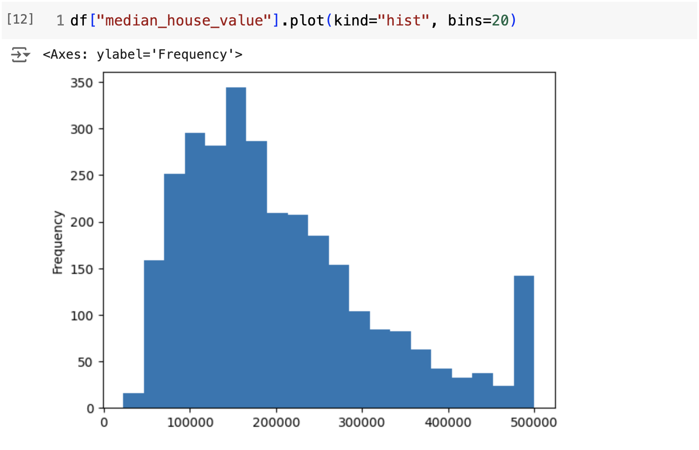
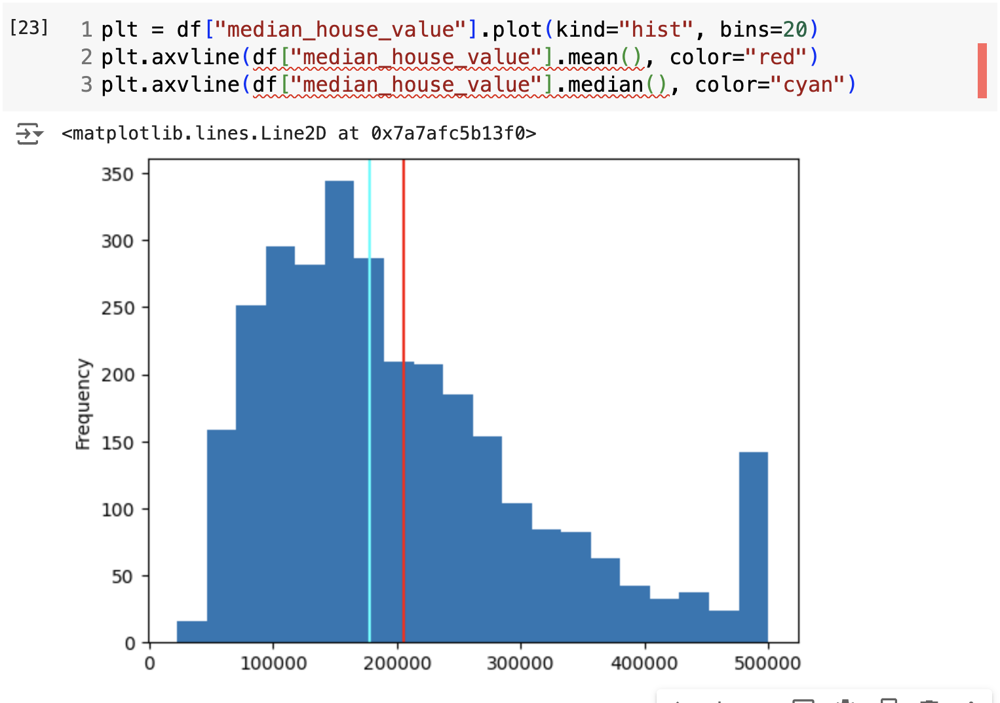
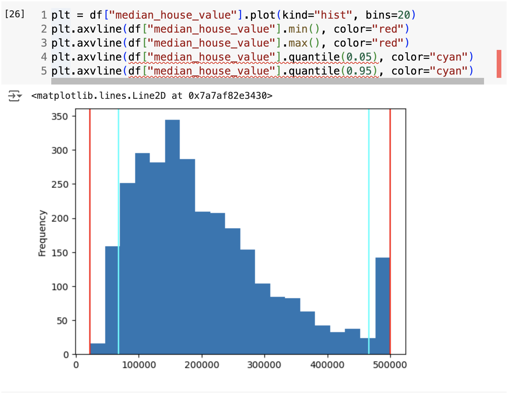

<!-- _class: lead invert -->

# What is Data Science?

---

**Interdisciplinary** field that uses **statistics**, **scientific methods**, and **algorithms** to **extract**, **extrapolate**, and **enact** knowledge and from **structured** and **unstructured** data.

---

<!-- _class: lead -->

---

## Types of Analysis

- **Descriptive**: Summarizing or explain trends within data.
- **Predictive**: Making predictions based on data.
- **Prescriptive**: Recommending actions based on the predictions.

---

## Example: Descriptive

Alice, a Data Scientist, pulls data on visits to her LA/NYC news-focused website, noting the times users arrived at the page and their IP addresses to determine their locations. She aggregates this data by hour, location, and screen size revealing notable spikes in traffic. 

At 1pm (EDT), there is a significant increase in visits from users in New York from smaller screens, and at 10am (EDT), there is a similar spike from users in Los Angeles from smaller screens.

How might she describe this data?

---

## Predictive

Alice is in charge of helping plan for the Chicago launch of the website. Part of her job is to predict the usage behavior of new Chicago readers to make the launch as successful as possible.

If she uses her description from the previous example, what are some things she might predict about readership in Chicago?

---

## Prescriptive

Alice's boss, Bob, is interested in increasing traffic to the site. He asks Alice to recommend actions based on her predictions.

What is her prescription?

---

## Key Tools in This Toy Example

- Alice needed access to the web traffic data.
- Alice needed tools to aggregate and identify trends in the data.
- Alice needed domain knowledge to interpret the data.
- Alice needed her prediction to be possible to test and validate.

---

<!-- _class: lead -->

# Describing Data
Part 1 of Mr. P's Guerilla Guide to Statistics

---

<!-- _class: lead -->

---

## What is "Typical"?

- **Median**: Middle value of a set of numbers. (Almost always better than the mean.)

### OR

- **Mean**: Average of a set of numbers.

---

<!-- _class: lead -->

I prefer the median because it's less skewed by outliers
(like the spike on the high-end of the graph).

---

## What's the Range?

- **Minimum**: The smallest value in a set.
- **Maximum**: The largest value in a set.

### OR

- **5th Percentile**: The value below which 5% of the data falls.
- **95th Percentile**: The value below which 95% of the data falls.

*Note: "Quantile" is the same as "Percentile", just multiply by 100*

---

<!-- _class: lead -->

Similarly, I prefer the 5th and 95th percentiles.
(But, in this case, they miss out on a lot of the data.)

---

## How Much Does the Value Change?

A standard deviation is a measure of the amount of variation of a random variable expected about its mean.

- low std dev: values tend to be close to the mean.
- high std dev: values are spread out over a wider range.

$$
stddev = {\sqrt {{\frac {1}{N-1}}\sum _{i=1}^{N}\left(x_{i}-{\bar {x}}\right)^{2}}}.
$$

---

