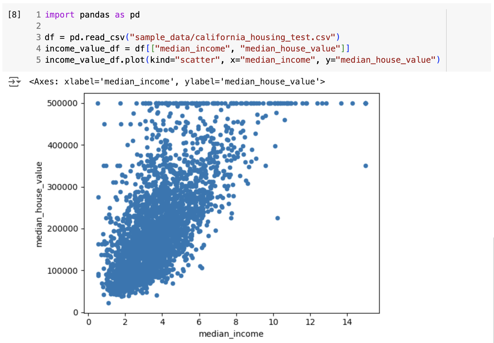

<!-- _class: lead invert -->
<!-- header: Python Modules -->

# Introducing Pandas
# 🐼

---

## Overview

Pandas is a package of fast, efficient data analysis tools for Python. It is built on NumPy and provides easy-to-use data structures and data analysis tools.

---

## Recap on Tabular Data in Python So Far...

<div class="columns"><div>

List-of-Lists:
```py
data = [
    ["name", "city", "age"],
    ["Alice", "New York", 25],
    ["Bob", "Los Angeles", 30],
    ["Charlie", "Chicago", 35],
]

age_idx = data[0].index("age")
data[2][city_idx]
```

</div><div>

List-of-Dictionaries:
```py
data = [
  {"name": "Alice", "city": "New York", "age": 25},
  {"name": "Bob", "city": "Los Angeles", "age": 30},
  {"name": "Charlie", "city": "Chicago", "age": 35},
]

data[1]["age"]
```

</div></div>

---

## Why Do We Need Something Else?

- **Performance**: Pandas is built on top of NumPy, which is a fast numerical library for dealing with vectors and matrices (faster than regular lists).
- **Convenience**: Pandas provides data structures that are easier to work with than lists and dictionaries.
- **Functionality**: Pandas provides built-in methods and functions for common data manipulation and analysis.
- **Compatibility**: Pandas is designed to work well with other libraries like Seaborn and Scikit-learn.

---


## Importing pandas

First, import the pandas library.
```python
import pandas as pd
```

By convention, we import pandas as `pd`. This is a common practice in the data science community.

---

## Pandas Data Structures

Pandas provides two fundamental data structures:
1. Series
2. DataFrame

These structures handle the vast majority of typical use cases in finance, social sciences, statistics, and many other areas.

---


---


---


## Pandas Series

A Series is a one-dimensional array-like object containing an array of data and an associated array of data labels, called its index.

```python
s = pd.Series([0.25, 0.5, 0.75, 1.0])
print(s)
```
```
0    0.25
1    0.50
2    0.75
3    1.00
dtype: float64
```

---

## Series Attributes

- `values`: The underlying numpy array
- `index`: The associated index array

```python
print(df.values)
print(df.index)
```
```
[0.25 0.5  0.75 1.  ]
RangeIndex(start=0, stop=4, step=1)
```

---

## Series Indexing

Series can be **indexed** regularly by integer position:
```python
s = pd.Series([0.25, 0.5, 0.75, 1.0], index=['a', 'b', 'c', 'd'])
s[1]
```
```
0.5
```
Or by a `string` label:
```python
s = pd.Series([0.25, 0.5, 0.75, 1.0], index=['a', 'b', 'c', 'd'])
s['b']
```
```
0.5
```

---

## Pandas DataFrame

A DataFrame is a two-dimensional array with both flexible row indices and flexible column names.

```python
area = pd.Series({'CA': 423967, 'TX': 695662, 'NY': 141297, 'FL': 170312, 'IL': 149995})
population = pd.Series({'CA': 38332521, 'TX': 26448193, 'NY': 19651127, 'FL': 19552860, 'IL': 12882135})
df = pd.DataFrame({'area': area, 'population': population})
print(df)
```
```
        area  population
CA    423967    38332521
TX    695662    26448193
NY    141297    19651127
FL    170312    19552860
IL    149995    12882135
```


Variables for DataFrames are almost always called `df` or `foo_df`.

---

## DataFrame Attributes

- `values`: The underlying numpy array (2d-list)
- `columns`: The column names
- `index`: The row names

```python
print(df.columns)
print(df.index)
print(df.values)
```
```
Index(['area', 'population'], dtype='object')
Index(['CA', 'TX', 'NY', 'FL', 'IL'], dtype='object')
[[ 423967 38332521]
 [ 695662 26448193]
```

---

## You Can Perform Math Between Series

Because of pandas is built on top of NumPy (a popular package for doing matrix math), we can do basic math operations on DataFrames and Series.


```python
df['population'] / df['area']
```
```
CA     90.413926
TX     38.018740
NY    139.076746
FL    114.806121
IL     85.883763
dtype: float64
```
---

## And Then We Can Add It To The DataFrame

DataFrames act like dictionaries in this way, so we can add a new column like this:

```python
df['density'] = df['population'] / df['area']
print(df)
```
```
      area  population    density
CA  423967    38332521  90.413926
TX  695662    26448193  38.018740
NY  141297    19651127 138.195210
FL  170312    19552860 114.806121
IL  149995    12882135  85.883763
```


---

## DataFrames Are The Best of Both Worlds

<div class="columns"><div>

Act like a dict-of-lists

```python
df["area"]
```
```
CA  423967
TX  695662
NY  141297
FL  170312
IL  149995
```
<span></span>
```py
df["area"]["TX"]
```
```
695662
```

</div><div>

Act like a list-of-dicts
```py
df.loc['TX']
```
```
area            695662
population    26448193
Name: TX, dtype: int64


```

<span></span>

```py
df.loc['TX']['area']
```
```
695662
```


</div></div>

---

## Constructing DataFrame

Several ways to construct a DataFrame:
```python
pd.DataFrame([[1, 2], [3, 4]], columns=['a', 'b'])
pd.DataFrame([{'a': 1, 'b': 2}, {'a': 3, 'b': 4}])
pd.DataFrame({'a': [1, 3], 'b': [2, 4]})
```

---

## Pandas Can Read CSVs

The most common way we'll use pandas in this class is to read CSV files. It's a much better CSV parser than the `csv` package!

```python
df = pd.read_csv('data.csv')
```

*But you can use pandas to read Excel files, SQL databases, and more!*

---

## Viewing Data

Use `.head()` to view the first few rows.
```py
>>> df.head(2)
    name  age         city
0  Alice   25     New York
1    Bob   30  Los Angeles
```

---

## Viewing Data

Use `.info()` to get a concise summary of the DataFrame.
```py
>>> df.info()
RangeIndex: 3 entries, 0 to 2
Data columns (total 3 columns):
 #   Column  Non-Null Count  Dtype 
---  ------  --------------  ----- 
 0   name    3 non-null      object
 1   age     3 non-null      int64 
 2   city    3 non-null      object
dtypes: int64(1), object(2)
memory usage: 200.0+ bytes
```

---

 ## Simple Aggregate Methods

- In addition to the normal `list` stuff, `Series` have some handy methods for aggregation.
  ```py
  >>> df['age'].mean()
  30.0
  >>> df['age'].sum()
  35
  ```
- When you use these methods on a `DataFrame`, they return a `Series`
  ```py
  >>> df.mean(numeric_only=True)
  age          31.0
  salary    60000.0
  ```

 --- 

## Selecting Multiple Columns

Selecting multiple columns returns a `DataFrame`.

```py
>>> df[['name', 'city']]
      name         city
0    Alice     New York
1      Bob  Los Angeles
2  Charlie      Chicago
```

---

## Filtering Data

In addition to selecting columns, you can Filter rows based on booleans (the results of conditionals):
```py
>>> df[df['age'] > 30]
      name  age     city
2  Charlie   35  Chicago

>>> is_new_york = df['city'] == 'New York'
>>> df[is_new_york]
    name  age      city
0  Alice   25  New York
```

---

## Adding and Modifying Columns

Add a new column:
```py
>>> df['salary'] = [50000, None, 70000]
```
Modify an existing column:
```py
>>> df['age'] = df['age'] + 1
>>> df
      name  age         city
0    Alice   26     New York
1      Bob   31  Los Angeles
2  Charlie   36      Chicago
```

---

## Visualizing Data with Pandas

- Pandas has built-in plotting capabilities.
- Use `df.plot()` to create simple plots.
- Use `df.plot(kind='bar')` to create a bar plot.
- Use `df.plot(kind='hist')` to create a histogram.
- Use `df.plot(kind='scatter')` to create a scatter plot.

*We'll talk more about data visualization in the next module.*

---

## Visualizing Data with Pandas

<!-- _class: lead -->



<small>(preview for next week)</small>

---

<!-- TODO: Need to cover more before this assignment -->

<!-- _class: lead -->

# Exercise

# http://gg.gg/1b92tc
