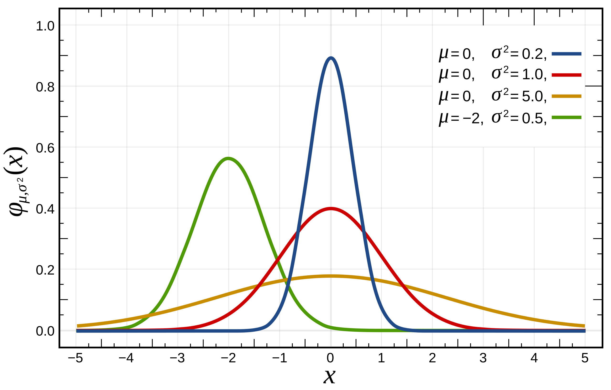

# Monday, July 1st
## Today's Lesson:
- Pandas Recap
- Describing Data Sets
- Data Visualization

## Warm-Up
### http://gg.gg/1b9wxp

---

<!-- _class: lead invert -->

# Statistics for Describing Datasets

---

<!-- _class: lead invert -->
<!-- header: "The Development of Statistics" -->
<!-- footer: "How Data Happened | Chris Wiggins, Matthew L Jones" -->

# Early Statistics

---

<div class="book-3d">
  <div class="book-3d__inner">
    
  </div>
</div>

<br>
<center><small>How Data Happened by Chris Wiggins and Matthew L Jones</small></center>

---

## Early Data Collection

- In the 18th century, as empires expanded and governance became more complex, rulers needed a way to understand their domains.
- They began recording data on population, land, and resources.
- **"Statistics" was a term that initially meant knowledge about the state**.


---


## Adolphe Quetelet

- Nineteenth-century Belgian astronomer
  - Body Mass Index (BMI)
  - The "Average Man" (l’homme moyen)

> "*The founder of the most important science in the whole world.*"
> – Florence Nightingale


---

- 1834, Quetelet travels to the Paris observatory and meets Laplace.
- Learns techniques to resolving the multiple observations of a star's position into a single value.
- Quetelet has the insight to take these ideas and apply them to social data such as crime and suicide rates.

> *Despite “the fluctuation of numbers,” there is “really a number whose value we seek to determine, whether it is the height of an individual . . . , or the right ascension of the polar star.*”

---

## Normal Distribution
<small>Bell Curve / Gaussian distribution</small>

- Symmetrical
- mean == median == mode
  - 68% in ±σ
  - 95% in ±2σ
  - 99.7% in ±3σ


---




---

## Fancis Galton

- Expands on Quetelet's ideas.
- Introduces **regression** and **correlation**.
- Aimed to rank individuals within distributions, influencing modern testing. His work led to the **eugenics** movement; advocating for selective breeding to improve human genetics.

> “We want abler commanders, statesmen, thinkers, inventors, and artists.”

---

## Regression


- Model the relationship between **dependent variables** and one or more **independent variables**.
- **Linear regression** is the most common type (line best fit).
  - $y = mx + b$
    - $m = \frac{n(\sum XY) - (\sum X)(\sum Y)}{n(\sum X^2) - (\sum X)^2}$
    - $b = \frac{\sum Y - m(\sum X)}{n}$

<!-- Francis Galton introduced the concept of "regression" to describe the tendency of offspring to revert towards the average characteristics of their parents, a phenomenon he observed in the heights of parents and their children. -->

---

## Correlation

- Defines the strength and direction of a relationship between two variables.
- Galton introduced the concept when studying heights of parents and their children.

---


---


---


---


---


---


---

<!-- _class: lead invert -->
<!-- header: "How Should I Look at a Dataset" -->
<!-- footer: "" -->

# How Should I Look at a Dataset

---

## 1. Ask yourself, What Kind of Data Do I Have?

- **Nominal**: Categories (e.g., colors)
- **Ordinal**: Ordered categories (e.g., ratings)
- **Interval**: Numeric but no true zero (e.g., temperature in °C)
- **Ratio/Metric**: Numeric w/ true zero (e.g., height, weight)

---


---

## 2. Measures of Central Tendency

- Mean: $\bar{x} = \frac{1}{n}\sum_{i=1}^n x_i$
- Median: Middle value when data is ordered
- Mode: Most frequent value

---

## 2. Measures of Central Tendency in Python

```python
values = [7, 2, 3, 4, 5, 6, 7, 7, 9, 4]
```

<div class="columns"><div>

Mean
```python
mean = sum(values) / len(values)
```
```
6.4
```

</div><div>

Median
```python
values = sorted(values)
n = len(values)
if n % 2 == 0:
    lo_med = values[n//2 - 1]
    hi_med = values[n//2]
    median = (lo_med + hi_med) / 2
else:
    median = values[n//2]
```
```
6.5
```

</div><div>

Mode
```python
freqs = {}
for value in values:
    if value in freqs:
        freqs[value] += 1
    else:
        freqs[value] = 1
mode = -1
hi_freq = 0
for value, freq in freqs.items():
    if freq > hi_freq:
        mode = value
        mode_freq = hi_freq
```
```
7
```

</div></div>

---

## 2. Measures of Central Tendency w/ Pandas

```python
import pandas as pd
values = pd.Series([7, 2, 3, 4, 5, 6, 7, 7, 9, 4])
```

<div class="columns"><div>

Mean
```python
mean = values.mean()
```
```
6.4
```

</div><div>

Median
```python
median = values.median()
```
```
6.5
```

</div><div>

Mode
```python
mode = values.mode()
```
```
7
```

</div></div>

---

## 3. Measures of Dispersion

- Range: $R = x_{max} - x_{min}$
- Standard Deviation: $s = \sqrt{\frac{\sum_{i=1}^n (x_i - \bar{x})^2}{n-1}}$
- Interquartile Range: $IQR = Q_3 - Q_1$

---

## 3. Measures of Dispersion in Python

```python
values = [7, 2, 3, 4, 5, 6, 7, 7, 9, 4]
```

<div class="columns"><div>

Range
```python
rng = max(values) - min(values)
```
```
7
```

</div><div>

Standard Deviation
```python
mean = sum(values) / len(values)
sum_2 = 0
for value in values:
    sum_2 += (value - mean) ** 2
variance = sum_2 / (len(values) - 1)
std_dev = variance ** (1/2)
```
```
5.822222222222222
```

</div><div>

Interquartile Range
```python
values = sorted(values)
n = len(values)
q1 = values[n//4]
q3 = values[3*n//4]
iqr = q3 - q1
```
```
2.414866761849468
```

</div></div>

---

## 3. Measures of Dispersion w/ Pandas

```python
values = [7, 2, 3, 4, 5, 6, 7, 7, 9, 4]
```

<div class="columns"><div>

Range
```python
rng = values.max() - values.min()
```
```
7
```

</div><div>

Standard Deviation
```python
std_dev = values.std()
```
```
2.414866761849468
```

</div><div>

Interquartile Range
```python
q1 = values.quantile(0.25)
q3 = values.quantile(0.75)
iqr = q3 - q1
```
```
2.5
```

---

## 4. Percentiles and Quartiles

- Percentile: $P_k = L + \frac{k(n+1)}{100}$
- Quartiles: $Q_1$ (25th percentile), $Q_2$ (median), $Q_3$ (75th percentile)

---

## 4. Percentiles and Quartiles w/ Pandas

```python
values = pd.Series([7, 2, 3, 4, 5, 6, 7, 7, 9, 4])

p05 = values.quantile(0.05)
p25 = values.quantile(0.25)
p50 = values.quantile(0.50)  # Same as median
p75 = values.quantile(0.75)
p95 = values.quantile(0.95)
```

---

## 5. Data Distribution

- Is it normal?
  - There are a few ways to check normality but they're not foolproof. Popular methods include Q-Q plots and the Shapiro-Wilk test.
- Skewness
  - Indicates asymmetry (> 0: right-skewed, < 0: left-skewed)
- Kurtosis
  - Measures tail heaviness

---


## 6. Correlation and Covariance

- Correlation: $r = \frac{\sum_{i=1}^n (x_i - \bar{x})(y_i - \bar{y})}{\sqrt{\sum_{i=1}^n (x_i - \bar{x})^2 \sum_{i=1}^n (y_i - \bar{y})^2}}$
- Covariance: $cov(X,Y) = \frac{\sum_{i=1}^n (x_i - \bar{x})(y_i - \bar{y})}{n-1}$

---

## 6. Correlation and Covariance w/ Pandas

```python
import pandas as pd
data = {
    'x': [1, 2, 3, 4, 5],
    'y': [2, 4, 6, 8, 10]
}
df = pd.DataFrame(data)

corr = df['x'].corr(df['y'])
cov = df['x'].cov(df['y'])
```

---

## 9. Outliers

- Is it significantly outside the inner fences?
  - $x < Q_1 - 1.5 * IQR$
  - $x > Q_3 + 1.5 * IQR$

- We can also look at the z-score to determine if it's an outlier.
  - $z = \frac{x - \bar{x}}{stddev}$
  - $z > 3$ or $z < -3$

- **Outliers are only outliers until they're not.**
