<!-- _class: lead -->

# Warm-Up
# http://gg.gg/1b9r6v

---

<!-- _class: lead invert -->
<!-- header: Data Visualization -->

# Data Visualization
With Seaborn

---

## Matplotlib

- **What is Matplotlib?**
  - Comprehensive library for creating static, animated, and interactive visualizations in Python.
  - Provides a wide range of plotting functionalities.
  - Highly customizable.

---

## Matplotlib

- **Key Features:**
  - **Versatility:** Line plots, scatter plots, bar charts, histograms, and more.
  - **Customization:** Extensive control over plot elements.
  - **Integration:** Works well with other Python libraries.
  - **Extensibility:** Can be used as a backend for other plotting libraries.

---

## Matplotlib

```python
import matplotlib.pyplot as plt

# Simple line plot
plt.plot([1, 2, 3, 4], [10, 20, 25, 30])
plt.title('Simple Line Plot')
plt.xlabel('X-axis')
plt.ylabel('Y-axis')
plt.show()
```

---

## Seaborn

- **What is Seaborn?**
  - Data visualization library built on top of Matplotlib.
  - Provides a high-level interface for drawing attractive and informative statistical graphics.
  - Designed to work well with Pandas data structures.

---

## Seaborn

- **Key Features:**
  - **Ease of Use:** Simplifies creating complex visualizations with less code.
  - **Aesthetics:** Default themes and color palettes for visually appealing plots.
  - **Statistical Plots:** Includes specialized plots like violin plots, box plots, and pair plots.
  - **Data Handling:** Works directly with Pandas DataFrames.

---

## Seaborn

```python
import seaborn as sns
import pandas as pd

# Load example dataset
df = sns.load_dataset('tips')

# Simple scatter plot
sns.scatterplot(x='total_bill', y='tip', data=df)
plt.title('Total Bill vs Tip')
plt.xlabel('Total Bill')
plt.ylabel('Tip')
plt.show()
```

---

## 1. Loading the Dataset

```python
import pandas as pd

# Load the dataset
df = pd.read_csv('most_streamed_spotify_songs_2024.csv')

# Display the first few rows
df.head()
```

---

## 2. Line Plot

Used to visualize trends over time.

```python
import pandas as pd
import seaborn as sns
import matplotlib.pyplot as plt

df = pd.read_csv('pokemon.csv')

# Line plot of Sp. Atk over generations
plt.figure(figsize=(12, 6))
sns.lineplot(x='Generation', y='Sp. Atk', data=df)
plt.title('Spc. Atk Over Generations')
plt.xlabel('Generation')
plt.ylabel('Spc. Atk')
plt.xticks(rotation=45)
plt.show()
```

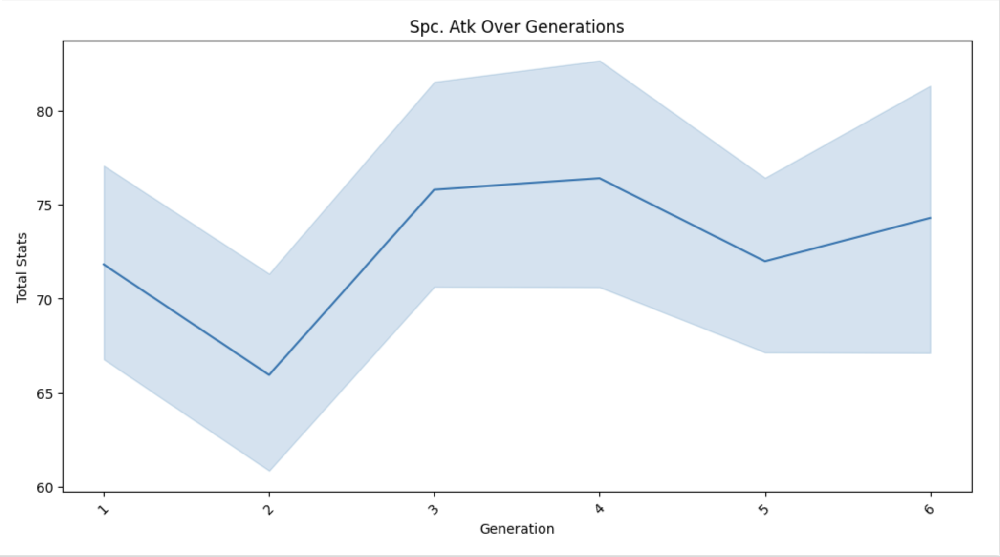

---

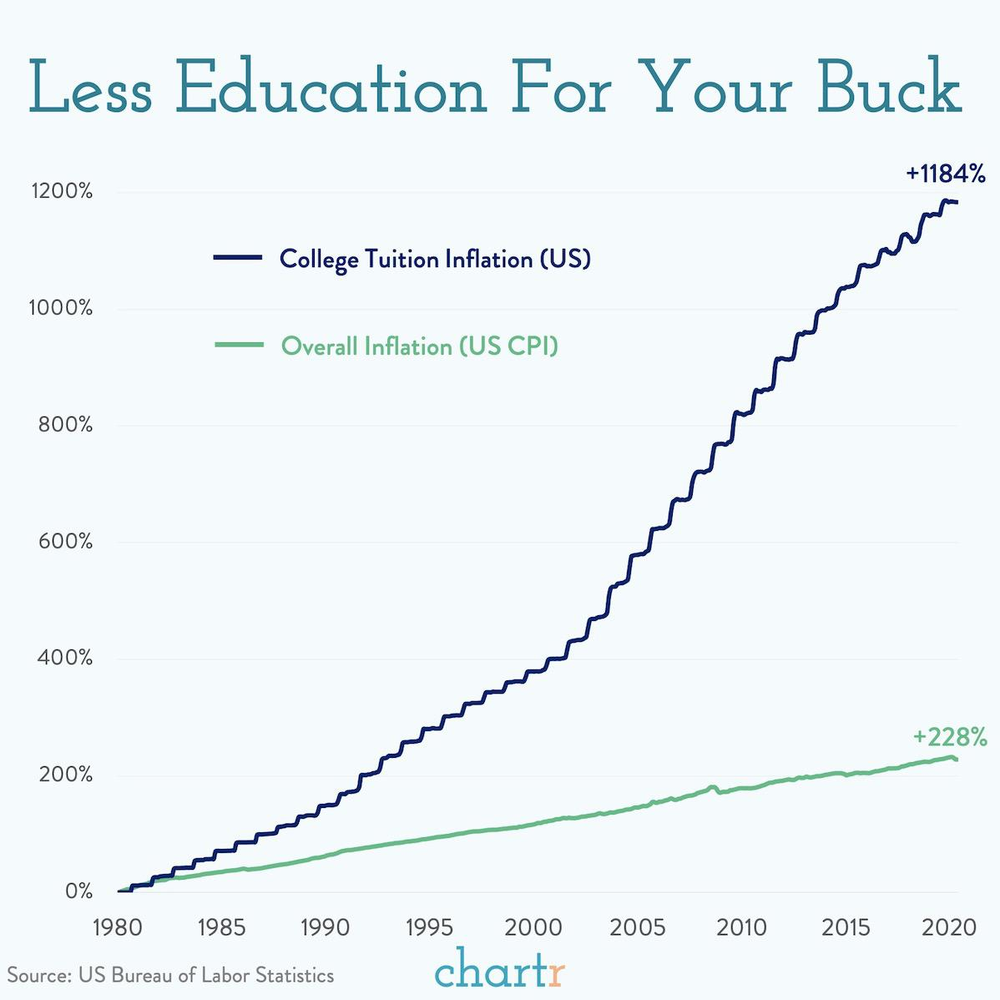

---

## 3. Bar Plot

Used to compare different categories.

<!-- TODO: pick a better bar chart than this, this is stupid -->

```python
# Bar plot of top 10 Pokémon by total stats
top_10_pokemon = df.nlargest(10, 'Total')

plt.figure(figsize=(12, 6))
sns.barplot(x='Total', y='Name', data=top_10_pokemon)
plt.title('Top 10 Pokémon by Total Stats')
plt.xlabel('Total Stats')
plt.ylabel('Name')
plt.show()
```

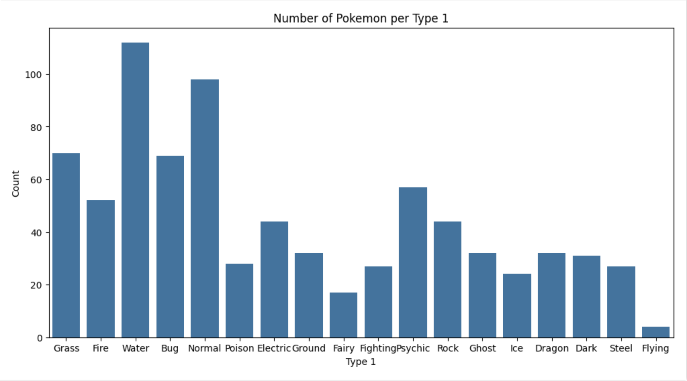

---

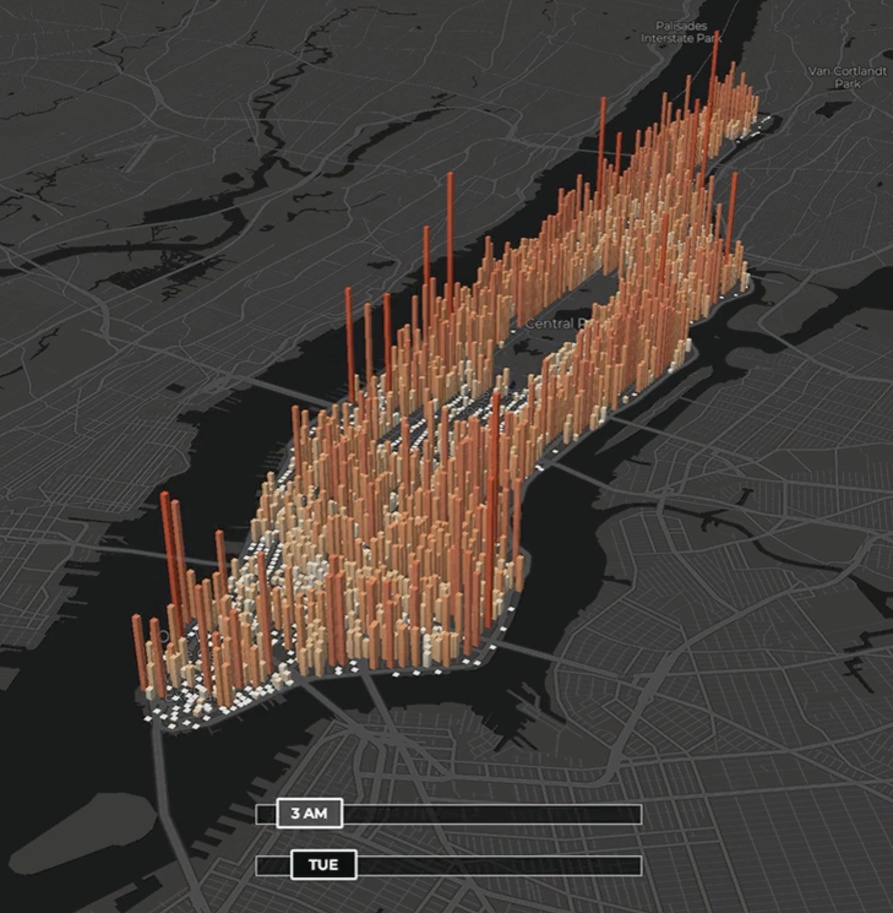

---

## 4. Scatter Plot

Used to explore the relationship between two variables.
```python
plt.figure(figsize=(12, 6))
sns.scatterplot(x='Attack', y='Sp. Atk', data=df)
plt.title('Attack vs Sp. Atk')
plt.xlabel('Attack')
plt.ylabel('Sp. Atk')
plt.show()
```

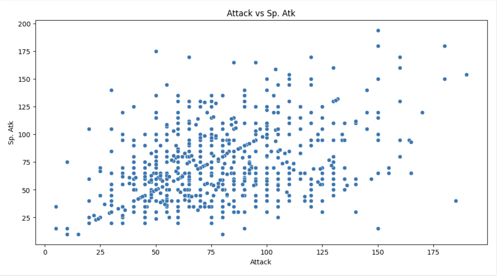

---

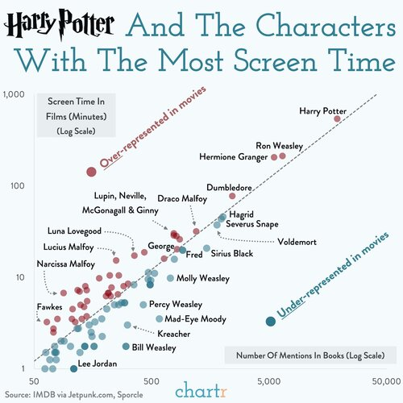

---

## 5. Histogram

Used to understand the distribution of a single variable.

```python
# Histogram of HP
plt.figure(figsize=(12, 6))
sns.histplot(df['HP'], bins=30, kde=True)
plt.title('Distribution of HP')
plt.xlabel('HP')
plt.ylabel('Frequency')
plt.show()
```

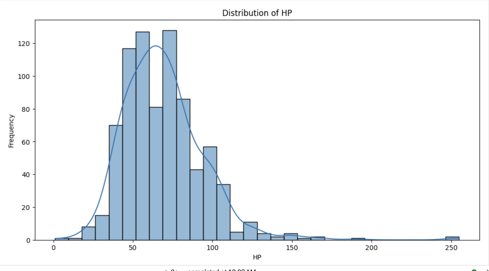

---

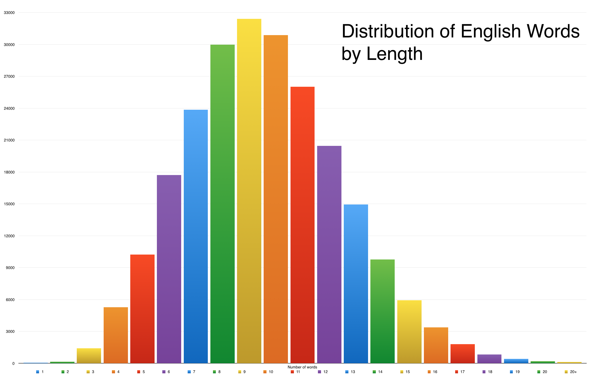

---

## 6. Box Plot

Used to display the distribution of data based on a five-number summary.

```python
# Box plot of Defense by Pokémon type
plt.figure(figsize=(12, 6))
sns.boxplot(x='Type 1', y='Defense', data=df)
plt.title('Defense by Pokémon Type')
plt.xlabel('Type 1')
plt.ylabel('Defense')
plt.xticks(rotation=45)
plt.show()
```

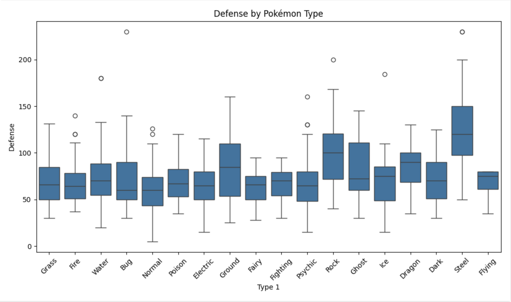

---

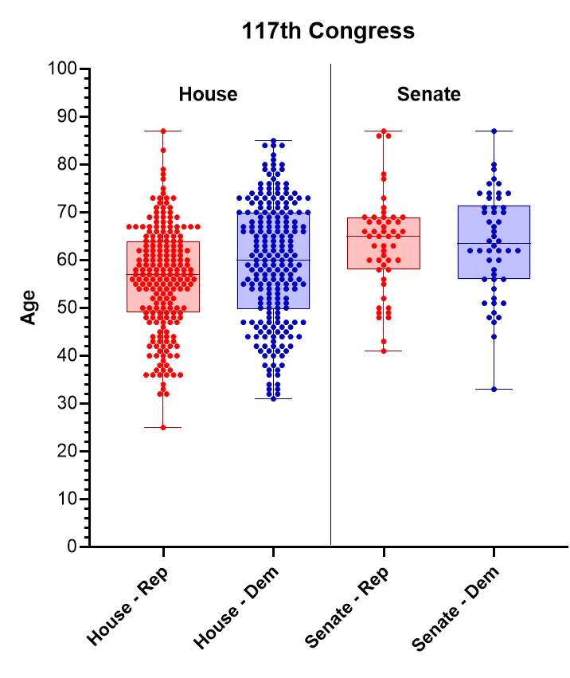

---

## 7. Heatmap

Used to visualize matrix-like data, showing correlation between variables.

```python
# Heatmap of count of pokemon that share types
df['Type 2'].fillna(df['Type 1'], inplace=True)
type_counts = df.groupby(['Type 1', 'Type 2']).size().unstack()
plt.figure(figsize=(12, 6))
sns.heatmap(type_counts, cmap='coolwarm', annot=True)
plt.title('Count of Pokemon With Type 1 and Type 2')
plt.xlabel('Type 2')
plt.ylabel('Type 1')
plt.show()
```

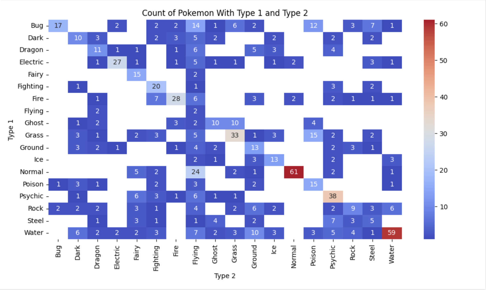

---

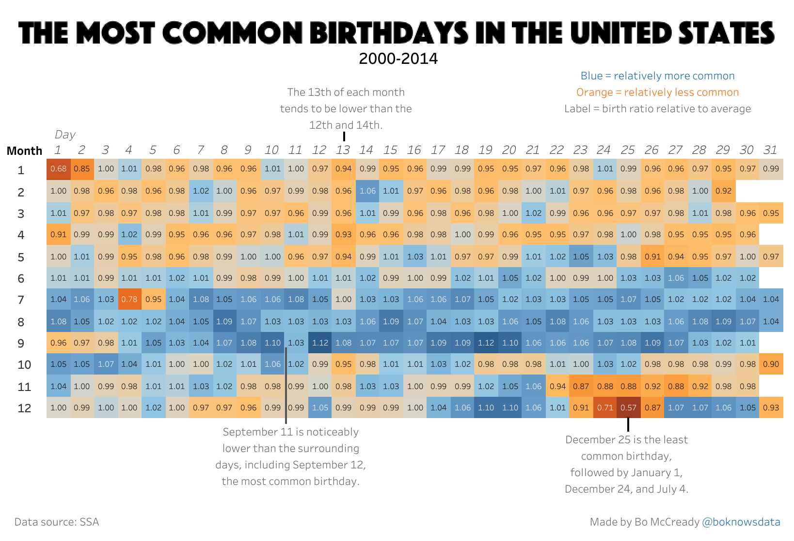

---

<!-- class: lead -->

# Exercise
# http://gg.gg/1b9rsa