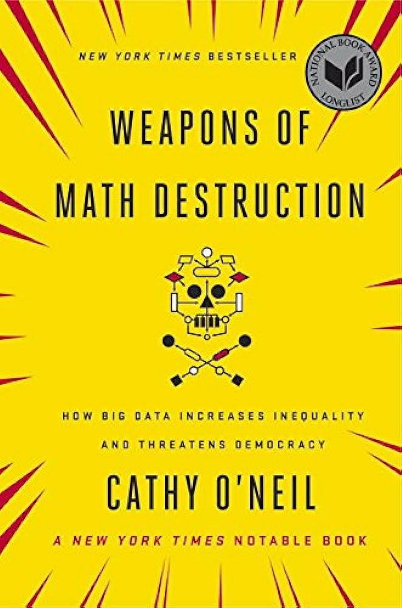

# Tuesday, July 2nd
## Today's Lesson:
- What is a Model
- Time Series Data
- Predicting Things

## Warm Up
## http://gg.gg/1ba2cn

---

<!-- _class: lead invert -->

# What is a Model

---

  

    
  

 

<small>Weapons of Math Destruction by Cathy O'Neil</small>

---

## What is "a Model"?

- **Definition**: A model is a simplified representation of some aspect of reality, used to predict or make decisions about the future.
- **Purpose**: 
    - Help us understand complex systems by focusing on key variables and relationships.
    - Predict or make decisions about the future.
- **Examples**:
    - Weather forecasts
    - Financial projections

---

## Characteristics of Predictive Models

- **Abstraction**: Simplifies reality by including only relevant features.
- **Input Data**: Based on historical data and assumptions.
- **Output**: Predictions or decisions about future events or behaviors.

---

## Real-world Implications

- **Decision-making**: Models influence significant decisions in finance, education, justice, and other fields.
- **Automation**: Increasing reliance on automated systems for efficiency and scalability.
- **Accountability**: They create transparency and can help us combat our own implicit biases.

---

<!-- _class: lead -->

# What Makes a Good Model?

---

## What Makes a Good Model?

- **Transparency:** The model should be clear and understandable to those affected by it, allowing for scrutiny and understanding of its workings.
- **Fairness:** The model should be equitable, not reinforcing or exacerbating existing inequalities, and should be designed to avoid biases.
- **Accountability:** There should be mechanisms in place to challenge and appeal decisions made by the model, ensuring it can be corrected or improved.

---

## What Makes a Good Model?

- **Data Relevance:** The model should use accurate and relevant data directly related to the outcomes it aims to predict, avoiding the use of proxies.
- **Feedback Mechanism:** The model should have a system for learning from its mistakes and improving over time based on real-world outcomes.
- **Periodic Updates:** The model should be regularly updated with new data and insights to remain accurate and relevant.

---

## What Makes a Good Model?

- **Limited Scope:** The model should focus on specific, well-defined tasks and not overreach beyond its designed purpose.
- **Ethical Considerations:** The model should be developed and used with a strong ethical framework, considering the broader societal impact.

---

# Some Examples of Good Models

---

## Baseball Recruiting Models (Moneyball)

- **Scenario**: Oakland Athletics use statistical models to recruit undervalued players.
- **Data**: Historical player performance data.
- **Outcome**: Success in identifying undervalued players and winning games.
- **Clear Metrics**: Batting averages, on-base percentages, and other well-understood metrics.
- **Transparency**: Methods and data are accessible to all teams.

---

## 538 Election Forecasting

- **Scenario**: Nate Silver's team predicts election outcomes using statistical models.
- **Data**: Polling data, historical trends, and other factors.
- **Outcome**: Accurate predictions of election results.
- **Transparency**: Methods and assumptions are clearly explained and souce data is open to the public (bi-weekly "Model Talk" podcast).
- **Dynamic**: Regularly updated with new polling data.

---

# What Makes a Bad Model?

---

## What Makes a Bad Model?

- **Opacity:** The model is not transparent and its workings are not understood by those affected by it.
- **Data Misuse:** The model uses biased or incorrect data, leading to flawed conclusions.
- **Optimization for Efficiency Over Fairness:** The model prioritizes efficiency and cost-saving over fairness and accuracy.

---

## What Makes a Bad Model?

- **Feedback Loop:** The model's predictions influence behaviors in a way that reinforces its own assumptions, often worsening the situation for those it targets.
- **Perpetuity:** The model operates continuously without sufficient updates or oversight.
- **Unaccountability:** There is no way to appeal or challenge the outcomes produced by the model.

---

## Teacher Evaluation Model (IMPACT in Washington, D.C.)

- **Data Relevance:** Relied heavily on standardized test scores, which are poor proxies for teaching quality.
- **Fairness:** Evaluated teachers mainly on student test scores, not accounting for external factors affecting performance.
- **Accountability:** Provided no meaningful way for teachers to appeal or understand their evaluations.
- **Feedback Mechanism:** Lacked a mechanism to learn from mistakes or incorporate feedback.

---

## Example: Prison Recidivism

- **Transparency:** Opaque, with individuals often unaware of how their risk scores are determined.
- **Fairness:** Tended to perpetuate racial and socio-economic biases, unfairly impacting minorities and the poor.
- **Accountability:** Provided limited ability for individuals to contest their risk scores.
- **Data Relevance:** Used biased historical data, leading to flawed predictions and reinforcing existing biases.
- **Feedback Mechanism:** Lacked a robust system for updating and correcting predictions based on actual outcomes.

---

## US News College Rankings System

- **Fairness:** Favored wealthy institutions, exacerbating inequalities and driving policies that prioritize rankings over education quality.
- **Data Relevance:** Used proxies like alumni donations and reputation surveys, which do not directly measure educational quality.
- **Bad Incentives:** Encouraged colleges to game the system by increasing application and rejection rates rather than focus on improving education.

---

## Weapons of Math Destruction

Some models are bad enough to be considered "Weapons of Math Destruction" (WMDs). These models:

- **Reinforce Inequality**: They exacerbate existing social and economic disparities.
- **Lack Redress**: Individuals have little recourse against incorrect or unfair decisions.
- **Erode Trust**: Lack of transparency leads to distrust in systems and institutions.
- **Self-Perpetuate**: Faulty models can create feedback loops that perpetuate their own biases and errors.

---

## Discussion

- What are some examples of models you've encountered in your life?
- How have these models affected you or others?
