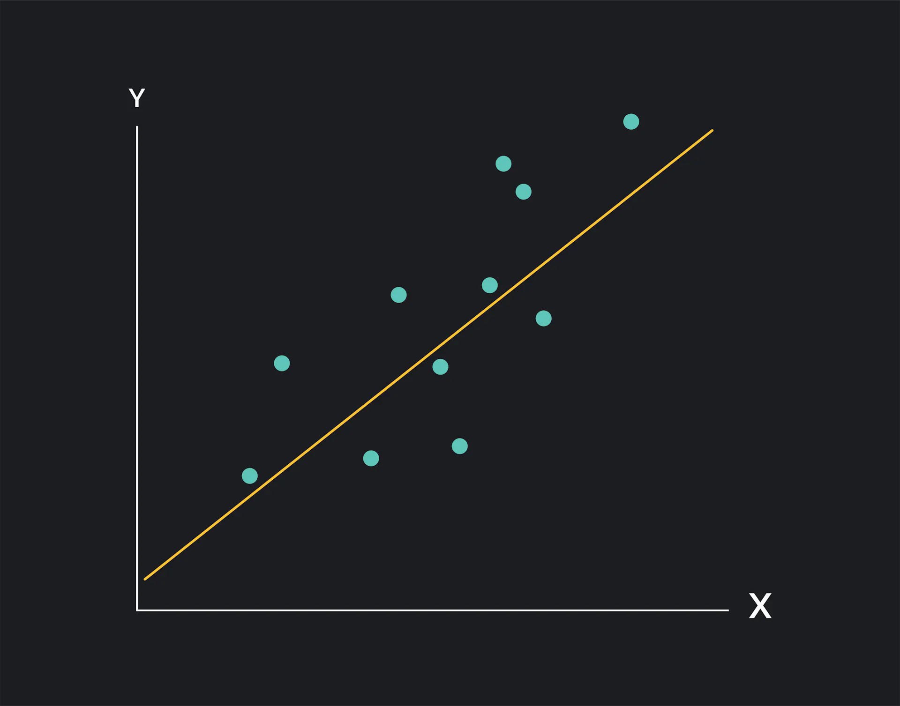

<!-- _class: lead invert -->

# Time Series Data

---

## What is a Time Series?

- A sequence taken at successive equally spaced points in time.
- Usually ratio/metric data indexed by time.

---

## Examples of Time Series Data

<div class="columns">

- **Stock Prices:** Daily closing prices of a company’s stock.
- **Weather Data:** Hourly temperature readings from a weather station.
- **Economic Indicators:** Monthly unemployment rates.
- **Traffic Data:** Hourly traffic volume on a particular road.

<span></span>

- **Energy Consumption:** Daily electricity usage for a city.
- **Medical Monitoring:** Heart rate readings taken every minute from a wearable device.
- **Website Analytics:** Daily website visitors and page views.
- **Climate Data:** Annual average CO2 levels in the atmosphere.

</div>

---


---

## Regression



- Model the relationship between **dependent variables** and one or more **independent variables**.
- **Linear regression** is the most common type (line best fit).
  - $y = mx + b$
    - $m = \frac{n(\sum XY) - (\sum X)(\sum Y)}{n(\sum X^2) - (\sum X)^2}$
    - $b = \frac{\sum Y - m(\sum X)}{n}$

---

<!-- class: lead -->

# Exercise

# http://gg.gg/1ba28x

---
<!-- _class: lead invert -->

# Patterns in Time Series Data

---
## Windowing

- A common operation in time series analysis is break your time series into windows.
- This allows you to calculate statistics over a fixed window of time.


---

## Linear Regression w/ Window


---

## Linear Regression w/ Sliding Window (2x)


---

## Linear Regression w/ Sliding Window (3x)


---

## Trend
- **Definition:** The long-term movement or direction in the data.
- **Characteristics**:
    - Represents the overall upward or downward slope in the data over time.
    - Can be linear or non-linear.
    - Indicates long-term progression in the data.
- **Example:** Increasing sales revenue over several years.

---


---

## Cyclicality
- **Definition:** Patterns that occur at irregular intervals, usually influenced by economic or business cycles.
- **Characteristics**:
    - Occurs over longer periods than seasonality.
    - Influenced by factors like economic conditions, market cycles, or business cycles.
    - Does not have a fixed period.
- **Example:** Economic cycles such as periods of boom and recession.

---


---

## Seasonality
- **Definition:** Regular and predictable patterns that repeat at fixed intervals.
- **Characteristics**:
    - Often related to calendar periods such as months, quarters, or seasons.
    - Repeats over a known, fixed period.
    - Can be influenced by factors like weather, holidays, or cultural events.
- **Example:** Increased retail sales during the holiday season every year.

---


---

## Noise

- **Definition:** Random variations that do not follow any pattern.
- **Characteristics**:
    - Erratic and unpredictable.
    - Does not convey meaningful information about the underlying process.
    - Often filtered out or smoothed to reveal more significant patterns.
- **Example:** Daily fluctuations in stock prices that do not follow any discernible trend.

---


---


---

## Decomposing

- **Objective:** Separate a time series into its components.

```python
ts = pd.Series(data, index=time)

# See: https://www.statsmodels.org/
from statsmodels.tsa.seasonal import seasonal_decompose

decomp = seasonal_decompose(ts, model='additive', period=50)
trend_comp = decomp.trend
seasonal_comp = decomp.seasonal
residual_comp = decomp.resid
```


---


# Exercise

# http://gg.gg/1ba2bs
