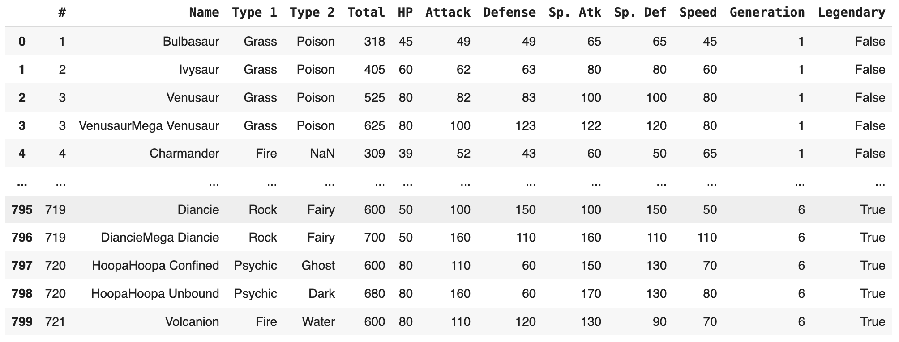
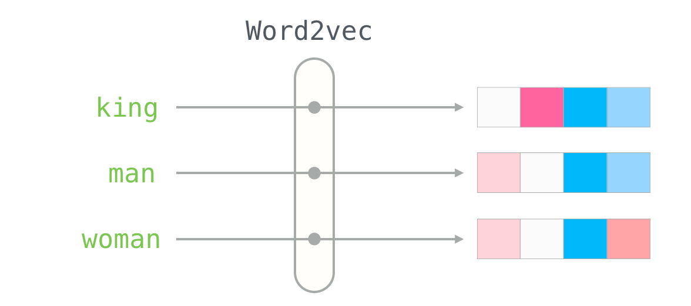
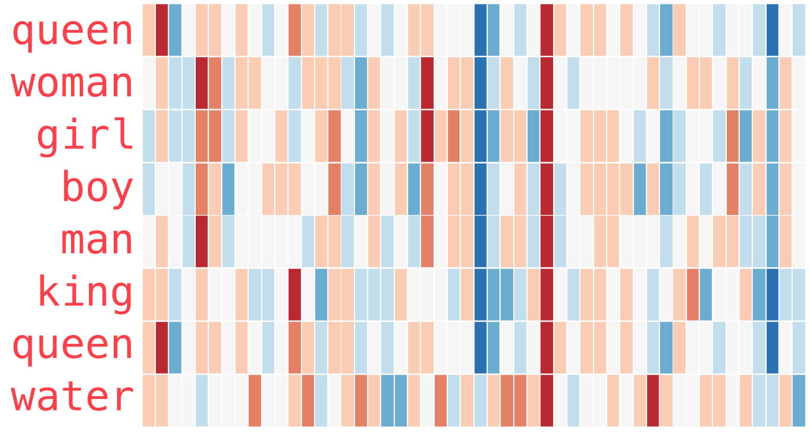

# Tuesday, July 2nd
## Today's Lesson:
- Natural Language Processing (NLP)
- Friday's Project

## Warm-Up:
## http://gg.gg/1babuw

---

<!-- _class: lead invert -->

# Introduction to NLP

---

## Definition of NLP

> Natural language processing (NLP) is an interdisciplinary subfield of computer science and artificial intelligence. It is primarily concerned with providing computers the ability to process data encoded in natural language and is thus closely related to information retrieval, knowledge representation and computational linguistics, a subfield of linguistics.


---

## Applications of NLP in Real-World Scenarios

- Language translation.
- Filtering internet hate speech, fake news, and spam.
- Content recommendation systems.
- *A component of* Text-completion suggestions.
- *A component of* Language processing and auto-captioning.
- *A component of* LLMs

---

## Introduction to Popular NLP Libraries

**NLTK:**
- Natural language ToolKit, an open-source library for python, written by Steven Bird, Edward Loper, and Ewan Klein.
- Very comprehensive, widely used, but somewhat outdated confusing.

**spaCy:**
- Implemented in Cython and developed by Matt Honnibal.
- Faster, easier to use, and more modern than NLTK but less comprehensive.

---

## NLP Terminology

**Document:**
- A piece of text, such as a sentence, a paragraph, a song, or a book.

**Corpus:**
- A collection of documents, usually of the same language and domain.

---

<!-- _class: lead -->

# Text Preprocessing

---

## Tokenization

**Word Tokenization:**
- Splitting text into individual words or tokens.
  - Example: "I love NLP!" becomes ["I", "love", "NLP", "!"]

**Sentence Tokenization:**
- Splitting text into sentences.
  - Example: "I love NLP! It's fascinating." becomes ["I love NLP!", "It's fascinating."]

---

## Stopwords Removal

**Stopwords:**
- Commonly used words that do not carry significant meaning and can be removed.

---

## Stemming and Lemmatization

**Stemming:**
- Reducing words to their base or root form.
  - Example: "running", "runner", "ran" all become "run".

**Lemmatization:**
- Reducing words to their base form using a dictionary-based approach.
  - Example: "better" becomes "good".

---

## Lowercasing and Punctuation Removal

**Lowercasing:**
- Converting all characters in the text to lowercase.
  - Example: "NLP is FUN" becomes "nlp is fun".

**Punctuation Removal:**
- Removing punctuation marks from the text.
  - Example: "Hello, world!" becomes "Hello world".

---

## Step 1: To Lower

```python
# Original sentence
sentence = "The men will be running Wednesday if the weather gets better."
sentence = sentence.lower()
print(sentence)
```
```
the men will be running wednesday if the weather gets better.
```

---

## Step 2: Punctuation Removal

```python
import spacy

nlp = spacy.load("en_core_web_lg")  # Load spaCy model

doc = nlp(sentence)  # Initialize as a spaCy object (list of tokens)
words = []
for token in doc:
    if not token.is_punct:
        words.append(token.text)
sentence = ' '.join(words)
print(sentence)
```
```
the men will be running wednesday if the weather gets better
```

---

## Step 3: Stopword Removal

```python
doc = nlp(sentence)
words = []
for token in doc:
    if not token.is_stop:
        words.append(token.text)
sentence = ' '.join(words)
print(sentence)
```
```
men running wednesday weather gets better
```

---

## Step 4: Stemming
- Using `PorterStemmer` from `nltk`

```python
doc = sentence.split(" ")
stemmer = PorterStemmer()
words = []
for token in doc:
    words.append(stemmer.stem(token))
sentence = ' '.join(words)
print(sentence)
```
```
men run wednesday weather get better
```

---

## Step 5: Lemmatization

```python
doc = nlp(sentence)
words = []
for token in doc:
    words.append(token.lemma_)
sentence = ' '.join(words
```
```
man run wednesday weather get well
```


---

<!-- _class: lead -->

# Basic Text Representation

---

## Problem Statement

- Machines want to work with numbers, not text.
- Machines are good at working with fixed sized vectors (lists) of numbers.
- How do we convert text data into numerical features?

---

## Bag of Words (BoW)

**Concept:**
- Represents text by counting the occurrence of each word in a document, ignoring grammar and word order.

**Algorithm:**
1. Create a vocabulary of unique words in the corpus.
2. Represent each document as a vector of word counts.

---

## Bag of Words Example

```python
sentence = "John likes to watch movies. Mary likes movies too."
bow = {}
for word in sentence.split():
    if word in bow:
        bow[word] += 1
    else:
        bow[word] = 1
print(bow)
```
```
{'John': 1, 'likes': 2, 'to': 1, 'watch': 1, 'movies.': 1, 'Mary': 1, 'movies': 1, 'too.': 1}
```

---

## Term Frequency-Inverse Document Frequency (TF-IDF)

Reflects the importance of a word in a document relative to the entire corpus.

**Intuition:**
*The word **"whale"** shows up disproportionately more in 'Moby Dick' than in other books, but **"man"** shows up a regular amount. Even though "man" might appear more, 'Moby Dick' is more likely about whales than men.*

---

## TF-IDF Calculation

1. Calculate the frequency of every word in the target document:
   ${\displaystyle \mathrm {tf} (t,d)={\frac {f_{t,d}}{\sum _{t'\in d}{f_{t',d}}}}}$

2. Calculate the log inverse-frequency of documents having the term in the corpus:
   ${\displaystyle \mathrm {idf} (t,D)=\log {\frac {N}{|\{d:d\in D{\text{ and }}t\in d\}|}}}$

3. Calculate the TF-IDF score for each term:
   ${\displaystyle \mathrm {tfidf} (t,d,D)=\mathrm {tf} (t,d)\cdot \mathrm {idf} (t,D)}$

---

## TF-IDF Example

**Corpus**
```python
corpus = ["John likes to watch movies.",
          "Mary likes movies too.",
          "John also likes to watch football games."]
tgt_doc = corpus[2]
```

**Term Frequency:**

```python
term_freq = {}
for word in tgt_doc.split():
    term_freq[word] = term_freq.get(word, 0) + 1
```

---

## TF-IDF Example (cont.)

**Inverse Document Frequency:**
```python
df = {}
for doc in corpus:
    for word in set(doc.split()):
        df[word] = df.get(word, 0) + 1
idf = {}
for word in df:
    idf[word] = math.log(len(corpus) / df[word])
```

---

## TF-IDF Example (cont.)

**TF-IDF:**
```python
tfidf = {}
for word in tgt_doc.split():
    tfidf[word] = term_freq[word] * idf[word]
print(tfidf)
```
```
{'John': 0.4054651081081644,
 'also': 1.0986122886681098,
 'likes': 0.0,
 'to': 0.4054651081081644,
 'watch': 0.4054651081081644,
 'football': 1.0986122886681098,
 'games.': 1.0986122886681098}
```

---

# Exercise
# http://gg.gg/1babz7

---


## Introduction to Word Embeddings

**Problem**
- Bag of words and TF-IDF do not capture the semantic relationships between words. They treat each word as independent.
- The vectors they produce are sparse and high-dimensional.

**Word2Vec:**
- Represents words in a continuous vector space with semantically similar words closer together.

---

## First, What is an Embedding?

Let's consider the stats from our Pokemon example.




---

```python
df.set_index("Name", inplace=True)
df[["HP", "Attack", "Defense", "Sp. Atk", "Sp. Def", "Speed"]]
df.loc["Bulbasaur"]
```
```
HP         45
Attack     49
Defense    49
Sp. Atk    65
Sp. Def    65
Speed      45
Name: Bulbasaur, dtype: int64
```

---

```python
df.loc[['Bulbasaur', 'Vanillite']]
```
```
           HP  Attack  Defense  Sp. Atk  Sp. Def  Speed
Name
Bulbasaur  45      49       49       65       65     45
Vanillite  36      50       50       65       60     44
```


---

```python
df.loc[['Pikachu', 'Diglett']]
```
```
         HP  Attack  Defense  Sp. Atk  Sp. Def  Speed
Name
Pikachu  35      55       40       50       50     90
Diglett  10      55       25       35       45     95
```


---

```python
df.loc[['Nidoqueen', 'Poliwrath']]
```
```
           HP  Attack  Defense  Sp. Atk  Sp. Def  Speed
Name
Nidoqueen  90      92       87       75       85     76
Poliwrath  90      95       95       70       90     70
```


---

## Word Embeddings

- Word embeddings are dense, low-dimensional vectors representing words.
- They capture semantic relationships between words.
- If two words are similar in meaning, their embeddings will be close together in the vector space.



---



---


---

# Word Embeddings w/ Spacy

```python
import spacy
import numpy as np

nlp = spacy.load("en_core_web_lg")  # Load spaCy model
cat = nlp("cat")
dog = nlp("dog")
ham = nlp("ham")

print(f"Distance from 'cat' to 'dog' is {np.linalg.norm(cat.vector - dog.vector)}")
print(f"Distance from 'dog' to 'ham' is {np.linalg.norm(cat.vector - ham.vector)}")
```
```
Distance from 'cat' to 'dog' is 42.8679084777832
Distance from 'dog' to 'ham' is 77.25950622558594
```

---

<!-- _class: lead -->

# Sentiment Analysis

---

## Definition and Use Cases

**Definition:**
- Determining the sentiment or emotion expressed in a piece of text.

**Use Cases:**
- Customer feedback analysis, social media monitoring, product review analysis.

---

## Simple Sentiment Analysis Using Lexicons

**Lexicon-Based Approach:**
- Uses predefined dictionaries of words with associated sentiment scores.
  - Example: "I am very happy with this product" by summing the sentiment scores of individual words.

---

```python
import spacy
from textblob import TextBlob

nlp = spacy.load("en_core_web_sm")
sentence = "I am very unhappy with this product."
doc = nlp(sentence)

blob = TextBlob(doc.text)

print(f"Sentiment Polarity: {blob.sentiment.polarity}")
print(f"Sentiment Subjectivity: {blob.sentiment.subjectivity}")
print(f"Assessments: {blob.sentiment_assessments.assessments}")
```
```
Sentiment Polarity: -0.78
Sentiment Subjectivity: 1.0
Assessments: [(['very', 'unhappy'], -0.78, 1.0, None)]
```

---

<!-- _class: lead -->

# Exercise!

# http://gg.gg/1bac8j


---

<!-- _class: lead invert -->

# Friday Assignment

# http://gg.gg/1backd
