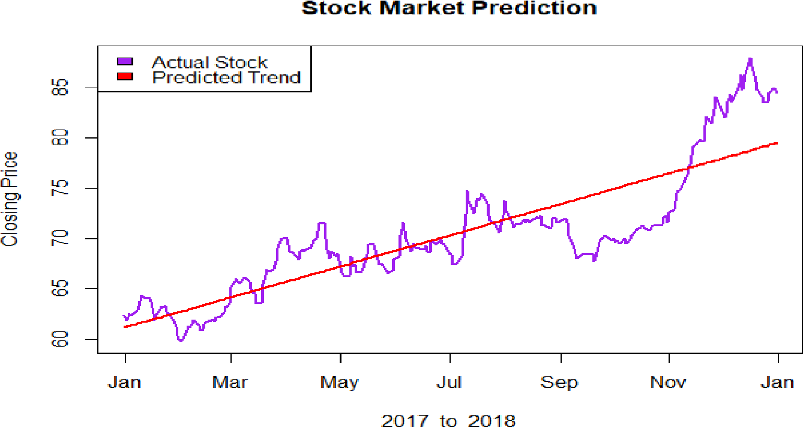
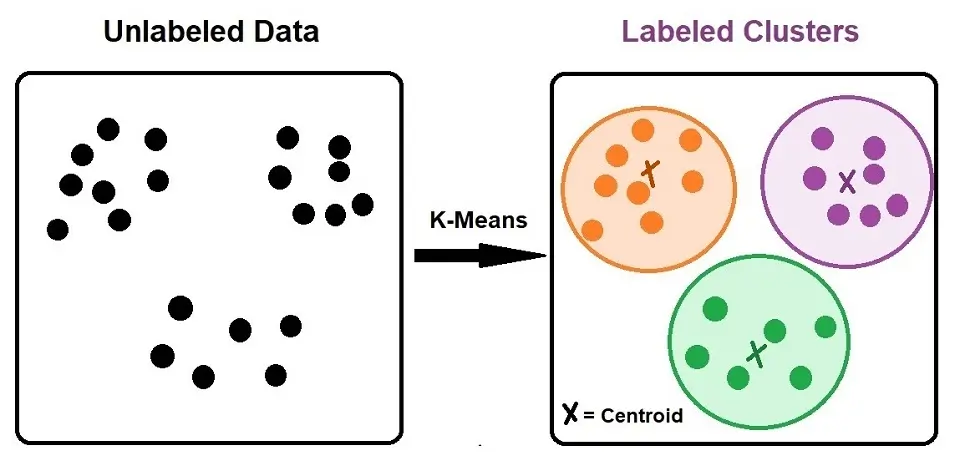
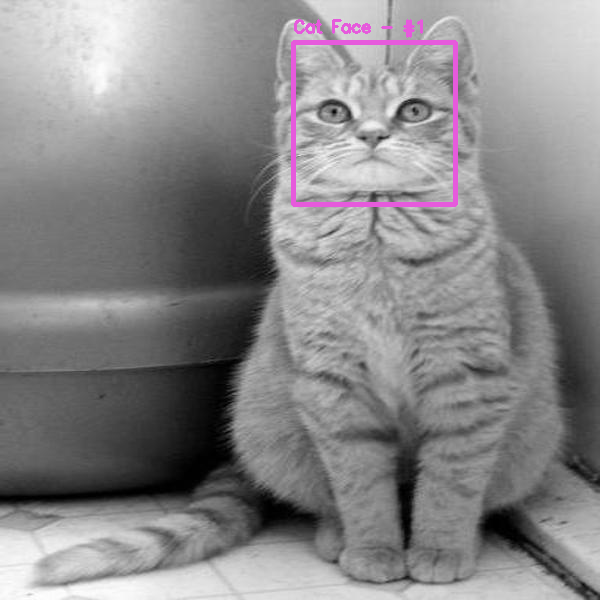

# Monday, July 8th
## Today
- What is Machine Learning
- Supervised Machine Learning
- Linear Regressions (Revisited)
- Logistic Regression

## Warm-Up
# `https://shorturl.at/2KYoI`

<!-- TODO, we should do this long before ML -->

---

<!-- _class: lead invert -->

# Introduction to Machine Learning

---

> Machine learning is a subfield of computer science that is concerned with building algorithms which, to be useful, rely on a collection of examples of some phenomenon. These examples can come from nature, be handcrafted by humans or generated by another algorithm.

*The Hundred-Page Machine Learning Book*

---

<!-- _class: lead -->
An algorithm that builds a statistical model based on a dataset.

<!-- TODO: Add a graphic here -->
---

## Types of Learning

- **Supervised Learning**: The dataset is a collection of labeled examples.
- **Unsupervised Learning**: The dataset is a collection of unlabeled examples.
- **Semi-Supervised Learning**: The dataset contains both labeled and unlabeled examples.
- **Reinforcement Learning**: The machine interacts with an environment to maximize rewards.

---

## Supervised Learning

- The goal is to produce a model that takes a feature vector \(x\) as input and outputs a label.
- **Most things we consider "Machine Learning" fall into this category.**

---

### Supervised Learning Examples

- **Credit Card Fraud Detection**
    - **Features:** Vendor, location, time, distance from last transaction
    - **Labels:** Chargebacks on previous transactions

- **Gmail Inbox Categories**
    - **Features:** Terms in the subject, body, origin email address
    - **Label:** "Primary", "Social", "Promotions", "Updates", "Forums"

- **Stock Market Prediction**
    - **Features:** Stock price from Feb 1st to March 1st
    - **Labels:** Stock price on March 7th.

--- 

---

## Unsupervised Learning

- The goal is to create a model that transforms input vectors or generates values to solve practical problems.

---

## Unsupervised Learning Examples

- **Grocery Store Customer Segmentation**
    - **Input:** Credit card numbers, purchase history
    - **Output:** Clusters of shopping behaviors

- **TFIDF**
    - **Input:** Term frequencies in documents
    - **Output:** Term-vectors representing documents

- **Word Embeddings (Word2Vec)**
    - **Input:** A corpus of words used in a language.
    - **Output:** Embeddings that can be used in Supervised Learning.

---

---

## Model-Based vs Instance-Based Learning

- Clustering is the most common example of Unsupervised Machine Learning.
- Clustering is an example of **Instance-Based Learning**.

- **Model-Based Learning** involves creating a model that can be used to make predictions.
- **Instance-Based Learning** involves storing examples and making predictions based on similarity to stored examples.

---

## Semi-Supervised Learning

- Combines labeled and unlabeled data to improve model performance.
- Adding unlabeled examples can provide more information about the data distribution.

---

---

## Reinforcement Learning

- Involves a machine "living" in an environment, perceiving states, and executing actions to maximize rewards.
- Example applications: Game playing, robotics, resource management.

---

---

<!-- _class: lead invert -->

# Supervised Machine Learning

---

### Classification

- In classification, our label is something from a _finite_ set of _classess_.
- When only two classes (_True/False_), we call it **Binary Classification**.
- When more than two, we call it **Multiclass Classification**.

### Regression
- In regression, our label is a **numerical real value**. We're often approximating some target.

---

### Supervised Learning Examples

- **Credit Card Fraud Detection** ← <mark>Binary Classification</mark>
    - **Features:** Vendor, location, time, distance from last transaction
    - **Labels:** Chargebacks on previous transactions

- Gmail Inbox Categories: ← <mark>Multiclass Classification</mark>
    - **Features:** Terms in the subject, body, origin email address
    - **Label:** "Primary", "Social", "Promotions", "Updates", "Forums"

- Stock Market Prediction: ← <mark>Regression</mark>
    - **Features:** Stock price from Feb 1st to March 1st
    - **Labels:** Stock price on March 7th.

---

## How Supervised Learning Works

1. **Data Collection**: Gather data with a clear set of inputs and outputs.
2. **Feature Extraction**: Convert inputs into feature vectors.
3. **Model Building**: Choose an algorithm, it's parameters, and train a model.
4. **Model Testing**: Validate your model using a **test set** that's separate from your of your training data and evaluate its performance.
5. **Prediction**: Apply the model to new data to make predictions.
