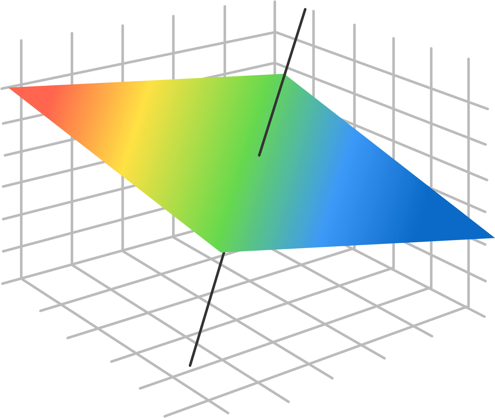
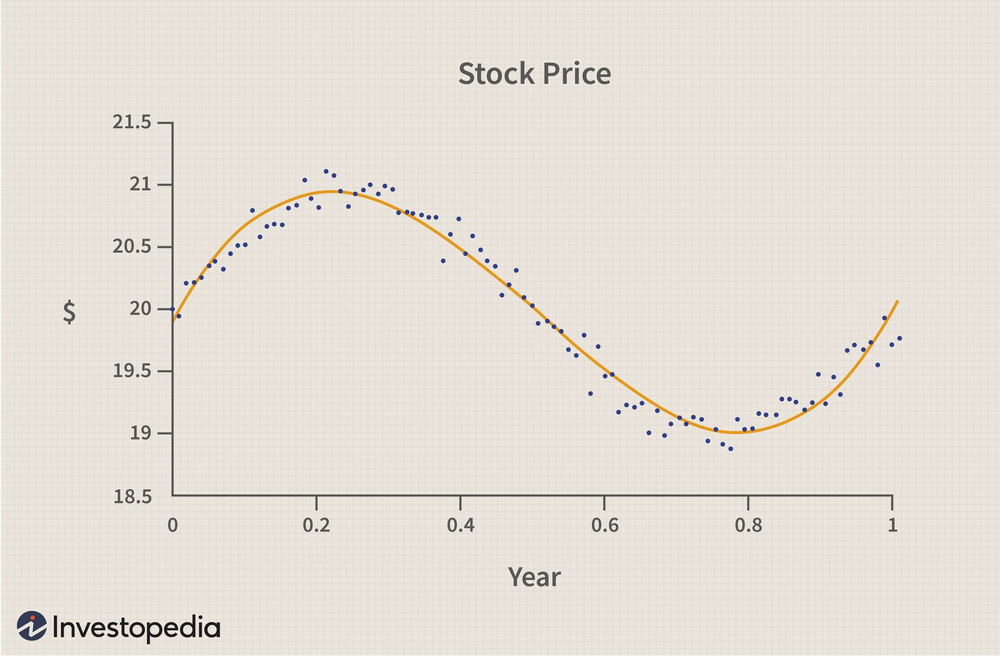

<!-- _class: lead invert -->

# Linear Regression
(revisited)

---

## What is Linear Regression?

- Linear regression is a fundamental algorithm in machine learning and can be thought of as simple supervised learning.
- It models the relationship between a dependent variable $y$ and one or more independent variables $X$ by fitting a linear equation to the observed data.

---

## Linear Regression Equation

- When rewritten for a simple linear regression model, we write it:
  $y = w_0 + w_1 x$ 
  - $y$: Dependent variable
  - $x$: Independent variable
  - $w_0$: Intercept
  - $w_1$: Slope

---

<H1>

$$
\begin{align}
y &= m x + b \\
y &= w_0 + w_1 x \\
\end{align}
$$

</H1>

---

$$
\mathbf{y} = \begin{bmatrix} 
y_1 \\ 
y_2 \\ 
\vdots \\ 
y_n 
\end{bmatrix}, \quad 
\mathbf{X} = \begin{bmatrix} 
1 & x_{11} \\ 
1 & x_{21} \\ 
\vdots & \vdots \\ 
 
1 & x_{n1} 
\end{bmatrix}, \quad 
\mathbf{w} = \begin{bmatrix} 
w_0 \\ 
w_1 \\ 
\end{bmatrix}
$$

---

## Loss Function

* The goal of linear regression is to find the values of $w$ that minimize the difference between the observed and predicted values of $y$.
* We quantify this using a **loss function** called **Mean Squared Error (MSE)**, calculated as:
  $MSE = \frac{1}{N} \sum_{i=1}^{N} (y_i - \hat{y}_i)^2$
  - $y_i$: Actual value
  - $\hat{y}_i$: Predicted value
  - $N$: Number of observations
* *All models have a loss function, to "fit" a model is to minimize the loss function.*

---

## Visualizing Linear Regression

- The line of best fit minimizes the vertical distances (errors) between the observed points and the predicted line.
- The sum of these squared distances is what we aim to minimize using the loss function.

---

## Why MSE Instead of Mean Absolute Error (MAE)?

* 
    - MSE penalizes larger errors more than MAE.
    - Squaring the errors emphasizes larger discrepancies, making the model more sensitive to outliers.
    - MSE is differentiable, which makes it easier to optimize using gradient-based methods.

---

## Fitting a Linear Regression

### Normal Equation

* For small to medium-sized datasets, linear regression can be solved using simple matrix math:
  $w = (X^T X)^{-1} X^T y$
  - $X$: Matrix of input features
  - $y$: Vector of output values
* For larger datasets (and for other algorithms we'll go over later), **Gradient Descent** is used.
* **For this class, we'll just use SKLearn.**

---

## Multiple Linear Regression

- For multiple linear regression, the model includes multiple independent variables:
  $$
  y = w_0 + w_1 x_1 + w_2 x_2 + \ldots + w_p x_p + 
  $$
  - $x_1, x_2, \ldots, x_p$: Independent variables
  - $w_1, w_2, \ldots, w_p$: Coefficients

---

$$
\mathbf{y} = \begin{bmatrix} 
y_1 \\ 
y_2 \\ 
\vdots \\ 
y_n 
\end{bmatrix}, \quad 
\mathbf{X} = \begin{bmatrix} 
1 & x_{11} & x_{12} & \ldots & x_{1p} \\ 
1 & x_{21} & x_{22} & \ldots & x_{2p} \\ 
\vdots & \vdots & \vdots & \ddots & \vdots \\ 
1 & x_{n1} & x_{n2} & \ldots & x_{np} 
\end{bmatrix}, \quad 
\mathbf{w} = \begin{bmatrix} 
w_0 \\ 
w_1 \\ 
w_2 \\ 
\vdots \\ 
w_p 
\end{bmatrix}
$$

---

<!-- _class: lead -->

# Exercise
Linear Regressions Revisited

https://shorturl.at/00DRc

---

## What is Polynomial Regression?

- Extension of linear regression to capture non-linear relationships.
- Fits a polynomial equation to the data

---

## Polynomial Regression Equation

- $y = w_0 + w_1x + w_2x^2 + \cdots + w_nx^n$
    - $y$: Dependent variable
    - $x$: Independent variable
    - $w_0, w_1, w_2, \ldots, w_n$: Coefficients

---

## Feature Transformation

- Transform $x$ into polynomial features
- Example:
  - Original feature: $x$
  - Polynomial features: $x, x^2, x^3, \ldots, x^n$

$$
\mathbf{X} = \begin{bmatrix}
x_0 & x_0^2 & x_0^3 \\
x_1 & x_1^2 & x_1^3 \\
x_2 & x_2^2 & x_2^3 \\
\end{bmatrix}
$$

---

## Model Training

- Similar to linear regression but with polynomial terms
- Minimize the sum of squared errors (SSE)
- Example:
$$
  \text{minimize} \sum_{i=1}^{n} (y_i - (w_0 + w_1x_i + w_2x_i^2 + \cdots + w_nx_i^n))^2
$$

---

## Overfitting and Underfitting

- **Underfitting**: Model is too simple, misses the pattern
- **Good Fit**: Model captures the underlying pattern without noise
- **Overfitting**: Model is too complex, captures noise

---

### Underfit

### Good Fit

### Overfit

