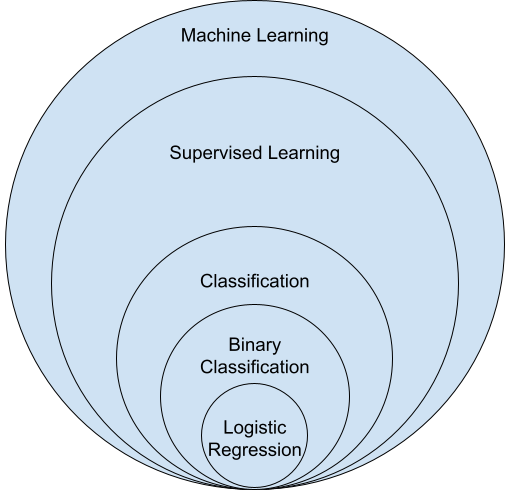
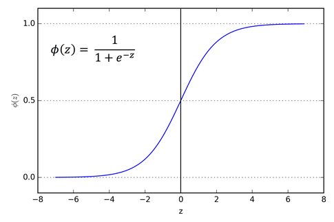
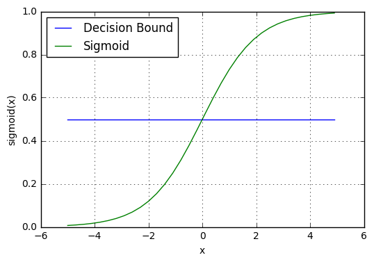

<!-- _class: lead invert -->

# Categorical Supervised Machine Learning Algorithms

---

## Logistic Regression

_Not to be confused with Linear Regression!_

### Problem Statement

- Logistic regression is used for binary classification problems.
- It models the probability that a given input $x$ belongs to a particular category.




---

### Supervised Learning Examples

<br>

**Credit Card Fraud Detection**
  - **Features:** Vendor, location, time, distance from last transaction
  - **Labels:** Chargebacks on previous transactions

---

# A Breief Interlude into Probability

- The probability of something happening is denoted as:
    $P(\text{event})$

- Two independent events have a joint probability:
    $P(A \cap B) = P(A) \times P(B)$

- For example, if the probability of flipping a coin on heads once is 1/2 than the probability of flipping it twice and getting heads both times is:
    $P(\text{heads}) \times P(\text{heads}) = 1/2 \times 1/2 = 1/4$

---

# Conditional Probability

- The probability of the positive class y given some non-independent event x is denoted as:
  $P(y=1|x)$

- Bayes' theorem relates the probability of the positive class to the likelihood and prior probability:
  $$
  P(y=1|x) = \frac{P(x|y=1)P(y=1)}{P(x)}
  $$

---

## COVID-19 Infection Example

- **Question**: I have a cough, what's the likelihood I have COVID-19?

  - $P(y=1)$: Prior probability of having COVID-19 (e.g., infection rate in the population)
  - $P(x|y=1)$: Likelihood of having symptoms given that you have COVID-19
  - $P(x)$: Probability of observing the symptoms (e.g., general probability of being sick)

- Using Bayes' theorem:
  $$
  P(\text{COVID}|\text{symptoms}) = \frac{P(\text{symptoms}|\text{COVID}) \cdot P(\text{COVID})}{P(\text{symptoms})}
  $$

---

### Example Calculation

- Suppose:
  - $P(\text{COVID}) = 0.05$ (5% of the population is infected)
  - $P(\text{symptoms}|\text{COVID}) = 0.90$ (90% of infected people show symptoms)
  - $P(\text{symptoms}) = 0.20$ (20% of the population shows symptoms)

- Then:
  $$
  P(\text{COVID}|\text{symptoms}) = \frac{0.90 \times 0.05}{0.20} = \frac{0.045}{0.20} = 0.225
  $$

- Interpretation: Given that you have symptoms, there is a 22.5% probability that you have COVID-19.

---

### Logistic Function

- The logistic function (or sigmoid function) is defined as:
  $\sigma(z) = \frac{1}{1 + e^{-z}}$
  where $z = w_0 + w_1 x_1 + w_2 x_2 + \ldots + w_p x_p$

### Probability Prediction

- The model predicts the probability of the positive class:
  $P(y=1|x) = \sigma(w_0 + \ldots + w_p x_p)$



---

### Decision Boundary

- The decision boundary is defined as:
  $P(y=1|x) = 0.5$

### Loss Function and Optimization

- Logistic regression uses the **cross-entropy loss function**:
- The model parameters are optimized using **gradient descent** to minimize the loss function.



---

## Validating Classification Models

- **Train/Test Split**: Randomly remove 20% of the examples to evaluate the model's performance.
  ```python
  df_train = df.sample(frac=0.8)
  df_test = df.drop(df_train.index)
  ```
  or
  ```python
  df_train, df_test = train_test_split(df, test_size=0.2)
  ```

- **Accuracy**: The proportion of correctly classified instances.
  $$
  \text{Accuracy} = \frac{\text{Number of correct predictions}}{\text{Total number of predictions}}
  $$

<!-- TODO include precision and recall in here --->


---

<!-- _class: lead -->

# Exercise

# https://shorturl.at/QwcIA