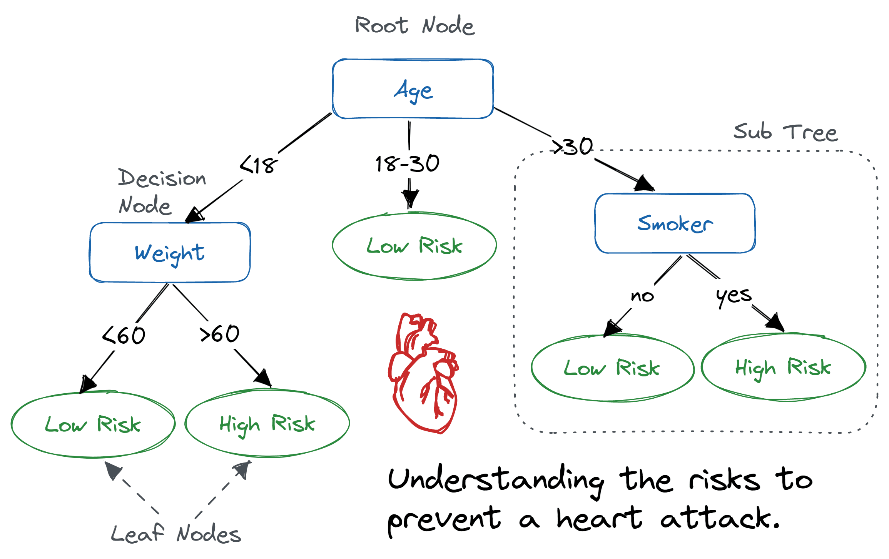
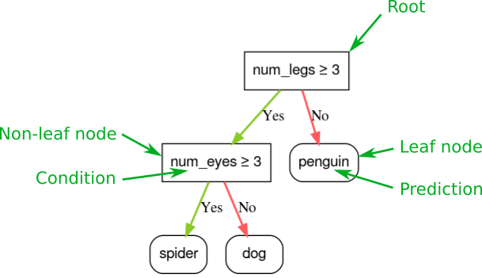
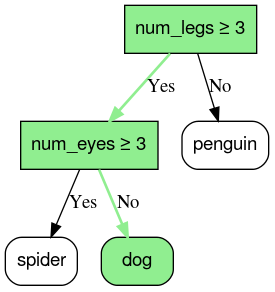

# Monday, July 8th
## Today
- Decision Trees
- Feature Engineering
- Unsupervised Machine Learning

---

<!-- _class: lead invert -->

# Decision Tree Learning

---



---

## What is a Decision Tree?

- A decision tree is a flowchart-like structure used for classification and regression tasks.
- It recursively splits the dataset into subsets based on feature values, forming a tree of decisions.

---

## Problem Statement

### Objective

- **Objective**: Predict the class label of an instance based on its feature values.
- **Input**: Numerical or categorical features and class labels.
- **Output**: A decision tree that classifies instances into predefined classes.



---

## Decision Tree Prediction

```python
X = pd.DataFrame({"num_legs": [4], "num_eyes": [2]})
mode.score(X)
```
```
dog
```



---

## Why Use Decision Trees?

- **Interpretability**: Easy to understand and visualize.
- **Feature Selection**: Automatically selects important features.
- **Non-Parametric**: No assumptions about the underlying data distribution.
- **Portability**: You can easily port the model to code.

---

## Portability

```python
def predict(x):
    num_legs = x["num_legs"]
    num_eyes = x["num_eyes"]
    if num_legs >= 3:
        if num_eyes >= 3:
            return "spider"
        else:
            return "dog"
    else:
        return "penguin"
```


---

## Tree Construction

- **Step 1**: Start with the entire dataset at the root.
- **Step 2**: Select the best feature to split the data based on **the chosen criterion**.
- **Step 3**: Split the data into subsets.
- **Step 4**: Recursively apply steps 2 and 3 to each subset.
- **Step 5**: Stop splitting when a stopping condition is met (e.g., maximum depth, minimum instances per node).

---

## Splitting Criteria -  Gini Impurity

- Measures the impurity of a node. Lower values indicate purer nodes.
- Gini impurity for a node with classes $1, 2, \ldots, C$:
  $$
  G = \sum_{i=1}^C p_i (1 - p_i)
  $$
  where $p_i$ is the proportion of instances of class $i$ in the node.

---

## Splitting Criteria -  Entropy

- Measures the randomness in the node. Lower values indicate less randomness.
- Entropy for a node with classes $1, 2, \ldots, C$:
  $$
  H = -\sum_{i=1}^C p_i \log(p_i)
  $$
  where $p_i$ is the proportion of instances of class $i$ in the node.

---

## Splitting Criteria - Information Gain

- Measures the reduction in entropy after a split.
- Information Gain for a split $S$:
  $$
  IG(S) = H(\text{parent}) - \sum_{j} \frac{|S_j|}{|S|} H(S_j)
  $$
  where $H(\text{parent})$ is the entropy of the parent node, $S_j$ are the subsets formed by the split, and $|S_j|$ is the number of instances in subset $S_j$.

---

## Pruning

- **Purpose**: Reduce overfitting by removing branches that have little importance.
- **Types**:
  - **Pre-pruning**: Stop growing the tree early based on a predefined condition.
    - Maximum depth.
    - Minimum instances per node.
  - **Post-pruning**: Grow the full tree and then remove branches that do not provide significant power.
    - Cost complexity pruning.

---

### Cost Complexity Pruning

Add a penalty for tree complexity to the cost function:
$$
R_\alpha(T) = R(T) + \alpha |T|
$$
where $R(T)$ is the misclassification rate of tree $T$, $\alpha$ is a complexity parameter, and $|T|$ is the number of leaves in the tree.

---

## Advantages and Disadvantages

### Advantages

- Easy to understand and interpret.
- Can handle both numerical and categorical data.
- Requires little data preprocessing.

### Disadvantages

- Prone to overfitting, especially with deep trees.
- Can be unstable; small changes in data can lead to different splits.
- Greedy algorithms may not find the globally optimal tree.

---

# Exercise
# https://shorturl.at/uk0fi