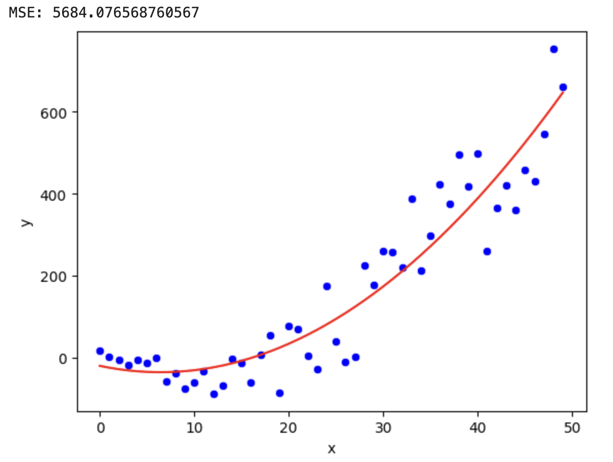
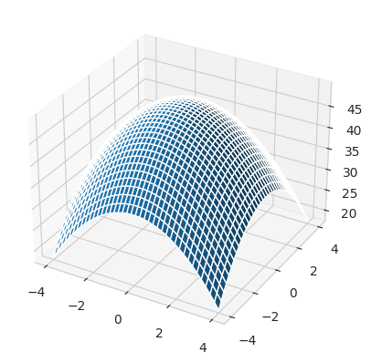
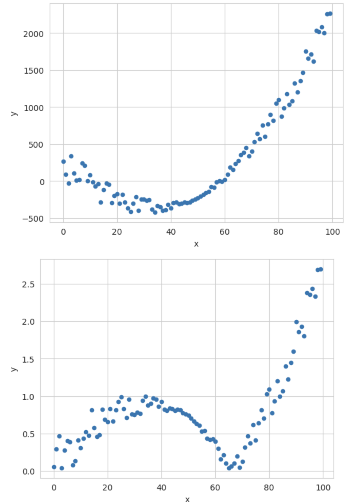
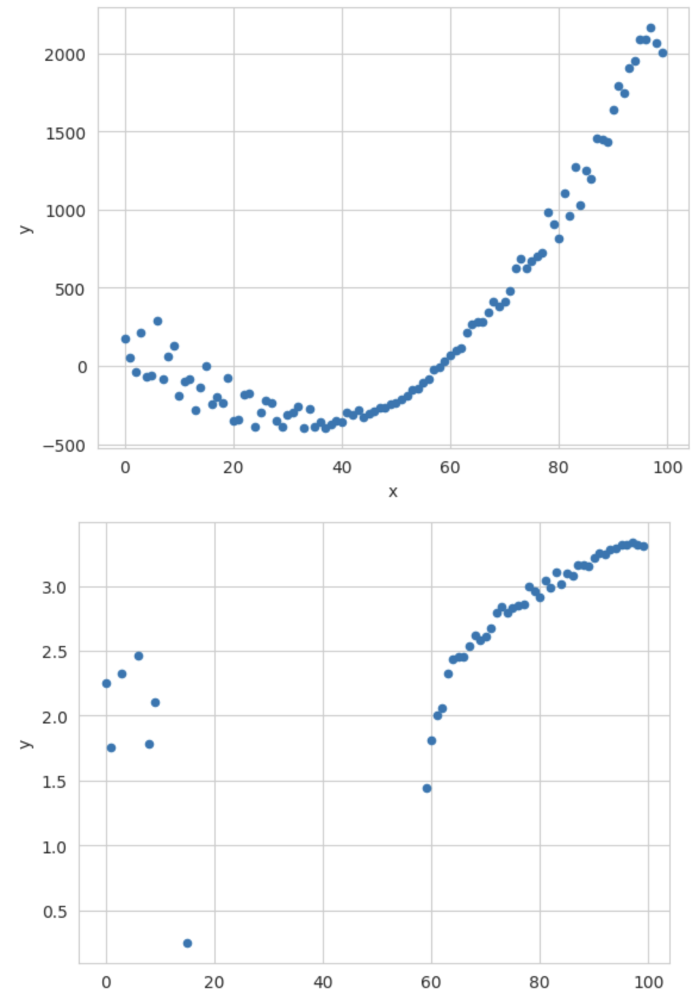

<!-- _class: lead invert -->


# Feature Engineering

---

## What is Feature Engineering?

- **Definition**: Feature engineering is the process of using domain knowledge to extract features from raw data.
- **Goal**: Improve the performance of machine learning models by creating better input representations.

---

## Why is Feature Engineering Important?

- **Enhances Model Performance**: Well-engineered features can significantly improve model accuracy.
- **Reduces Complexity**: Helps in reducing the dimensionality of the data and eliminating redundant features.
- **Transforms Raw Data**: Converts raw data into representations usable by the model.

---

<!-- _class: lead -->

# Feature Engineering Techniques

---

## Polynomial Features

Creating new features by raising existing features to a power.

$$
\mathbf{X} = \begin{bmatrix}
x_0 \\
x_1 \\
x_2 \\
\end{bmatrix}
\rightarrow
\mathbf{X} = \begin{bmatrix}
x_0 & x_0^2 & x_0^3 \\
x_1 & x_1^2 & x_1^3 \\
x_2 & x_2^2 & x_2^3 \\
\end{bmatrix}
$$




---

### Interaction Features

Creating new features by combining two or more features.


$$
\mathbf{X} = \begin{bmatrix}
x_{0,0} & x_{0,1} & x_{0,2} \\
x_{1,0} & x_{1,1} & x_{1,2} \\
x_{2,0} & x_{2,1} & x_{2,2} \\
\end{bmatrix}
\rightarrow
\mathbf{X} = \begin{bmatrix}
x_{0,0} & x_{0,1} / x_{0,2} \\
x_{1,0} & x_{1,1} / x_{1,2} \\
x_{2,0} & x_{2,1} / x_{2,2} \\
\end{bmatrix}
$$




---

### Normalization and Standardization

- **Normalization**: Scaling features to a range, typically [0, 1].
  - **Formula**: $x_{norm} = \frac{x - x_{min}}{x_{max} - x_{min}}$

- **Standardization**: Scaling features to have zero mean and unit variance.
  - **Formula**: $x_{std} = \frac{x - \mu}{\sigma}$

  

---

### Log Transformation

- **Definition**: Applying logarithmic transformation to reduce skewness.
- **Example**:
  - $x' = \log(x)$



---

### One-Hot Encoding

- **Definition**: Converting categorical data into numerical format.
- **Example**:
  - Converting animal types (dog, cat, penguin) into binary columns.


### Binning

- **Definition**: Converting continuous features into categorical ones by dividing the range into intervals.
- **Example**: 
  - Converting age into age groups: 0-18, 19-35, 36-50, 51+.

---

## One-Hot Encoding

- One-hot-encoding is a form of **feature engineering** that converts categorical data into a numerical format.
- It creates a binary column for each category in the original feature. The binary column has a value of 1 if the category is present and 0 otherwise.
- This lets us use categorical data in machine learning models that require numerical input.

---

## One-Hot Encoding Example

```python
data = pd.DataFrame({"animal": ["dog", "cat", "dog", "penguin"]})
pd.get_dummies(data)
```
```
   animal_cat  animal_dog  animal_penguin
0           0           1               0
1           1           0               0
2           0           1               0
3           0           0               1
```

---

<!-- _class: lead -->

# Exercise
# `https://shorturl.at/SUNVD`
