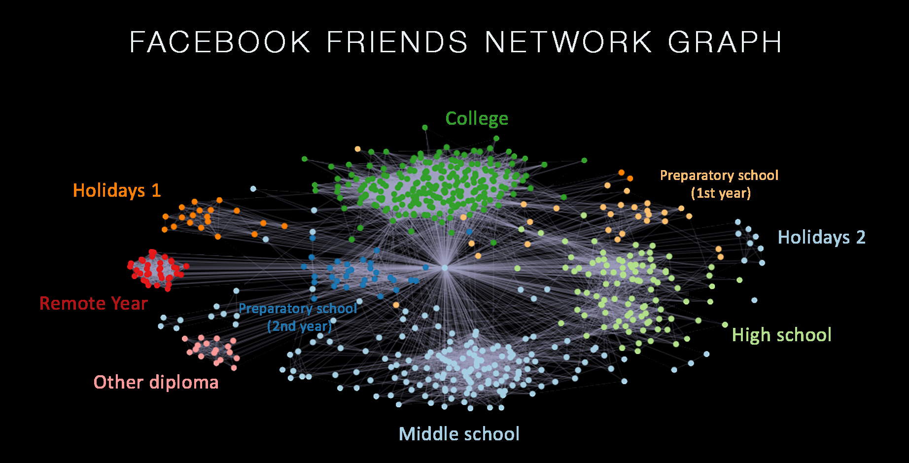
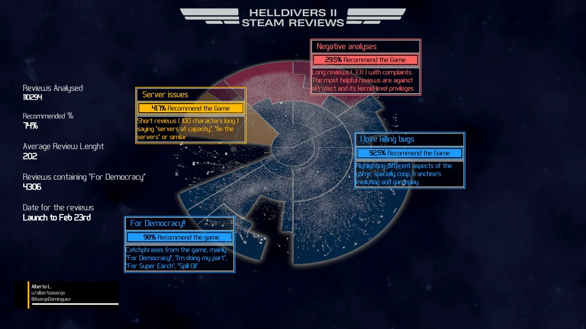
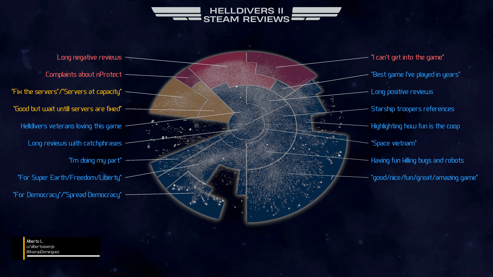
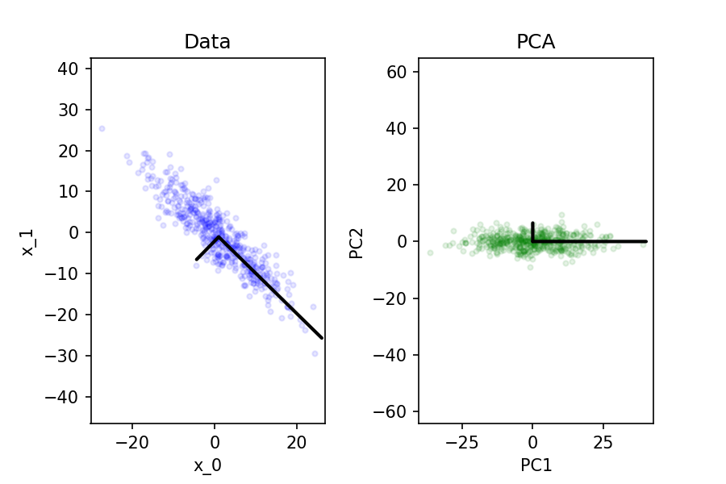

<!-- _class: lead invert -->

# Unsupervised Machine Learning

---

## Overview

- **Definition**: Unsupervised machine learning involves training algorithms on data without labeled responses.
- **Goal**: Discover underlying patterns, structures, and anomalies in the data.
- **Applications*:
  - Exploratory data analysis.
  - Used as a preprocessing step for supervised learning.

---

<!-- _class: lead -->

# Clustering

---

## What is Clustering?

- **Definition**: Clustering is the task of dividing a set of data points into groups (clusters) such that points in the same group are more similar to each other than to those in other groups.
- **Applications**: Market segmentation, document clustering, image segmentation, etc.

---

## K-Means Clustering

- **Algorithm**:
  1. Initialize $k$ cluster centroids randomly.
  2. Assign each data point to the nearest centroid.
  3. Recompute the centroids as the mean of all points in the cluster.
  4. Repeat steps 2-3 until convergence.
  
- **Objective Function**:
  $$
  \min \sum_{i=1}^k \sum_{x \in C_i} \|x - \mu_i\|^2
  $$
  where $\mu_i$ is the centroid of cluster $C_i$.

---

---

<!-- _footer: "https://www.reddit.com/r/dataisbeautiful/comments/8ecbjk/using_facebook_data_to_plot_my_friend_network_oc" -->

---

<!-- _footer: "/r/dataisbeautiful/comments/1b9j9oz/oc_helldivers_ii_steam_reviews_clustering_graph" -->

---

<!-- _footer: "/r/dataisbeautiful/comments/1b9j9oz/oc_helldivers_ii_steam_reviews_clustering_graph" -->

---

<!-- _class: lead -->

# Anomaly Detection

---

## What is Anomaly Detection?

- **Definition**: Identifying rare items, events, or observations that raise suspicions by differing significantly from the majority of the data.
- **Applications**: Fraud detection, network security, fault detection in systems.

---

## New Methods

### Machine Learning Methods

- **Isolation Forest**: 
  - Randomly select a feature and split the data.
  - Anomalies are isolated quicker than normal points.

### Clustering-Based Methods

- **DBSCAN** (Density-Based Spatial Clustering of Applications with Noise):
  - Points in low-density regions are considered anomalies.

---

<!-- _class: lead -->

# Principal Component Analysis (PCA)

---

## What is PCA?

- **Definition**: PCA is a dimensionality reduction technique that transforms data into a new coordinate system.
- **Goal**: Reduce the number of dimensions while preserving as much variance as possible.

---

## PCA Steps

1. **Standardize the Data**:
   - Ensure each feature has zero mean and unit variance.
2. **Compute the Covariance Matrix**:
   - Measure how features vary with respect to each other.
3. **Compute Eigenvalues and Eigenvectors**:
   - Determine the directions of maximum variance.
4. **Project the Data**:
   - Transform the data onto the new axes defined by the eigenvectors.

---

## Applications of PCA

- **Visualization**:
  - Reducing data to 2 or 3 dimensions for plotting.
- **Noise Reduction**:
  - Removing components with low variance.
- **Feature Extraction**:
  - Combining original features into a smaller set of uncorrelated features.

---

# Summary

- **Clustering** groups similar data points together.
- **Anomaly Detection** identifies data points that differ significantly from the majority.
- **PCA** reduces the dimensionality of data while preserving variance.

---

# Conclusion

- Unsupervised machine learning techniques are powerful tools for discovering hidden patterns and structures in data.
- Clustering, anomaly detection, and PCA each have unique applications and methodologies.
- We can pair unsupervised learning with supervised learning to build more robust models.

---

# Exercise

https://shorturl.at/J9hGc