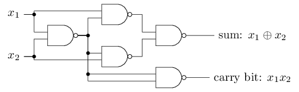
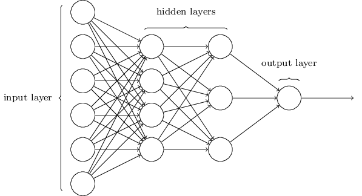

# Wednesday, July 10th
- Neural Networks
- Convolutional Neural Networks

## Warm-Up
## `https://shorturl.at/QeuZY`

---

<!-- _class: lead invert -->

# Neural Networks

---

# Frank Rosenblatt's Perceptron


---

# Perceptron

- A binary classifier
- Emulates logical operators such as AND, OR, and NAND
- Weights are adjusted to minimize errors
- Based on the idea of a neuron


---

> [it is] the first machine which is capable of having an original idea.
> [it will] walk, talk, see, write, reproduce itself and be conscious of its existence.
~ Frank Rosenblatt, 1958

---

## Perceptrons

- **Perceptron**: A simple model of a neuron.
- **Inputs**: Multiple binary inputs.
- **Output**: Single binary output.
- **Weights**: Each input is assigned a weight.
- **Activation**: Sum of weighted inputs compared to a threshold.


---


### Activation Function

- If the weighted sum exceeds the threshold, $b$, the output is 1.
- Otherwise, the output is 0.

$$
\begin{eqnarray}
  \mbox{output} & = & \left\{ \begin{array}{ll}
      0 & \mbox{if } \sum_j w_j x_j \leq \mbox{ b} \\
      1 & \mbox{if } \sum_j w_j x_j > \mbox{ b}
      \end{array} \right.
\tag{1}\end{eqnarray}
$$

---

### Activation Function
- Using matrix math, we can rewrite the activation function as:

$$
\begin{eqnarray}
w = \begin{bmatrix} 
w_1 \\ 
w_2 \\ 
\vdots \\ 
w_n 
\end{bmatrix}
x = \begin{bmatrix} 
x_{11} \\ 
x_{21} \\ 
\vdots \\ 
x_{n1} 
\end{bmatrix} 
\rightarrow \quad
  \mbox{output} = \left\{ 
    \begin{array}{ll} 
      0 & \mbox{if } w\cdot x + b \leq 0 \\
      1 & \mbox{if } w\cdot x + b > 0
    \end{array}
  \right.
\end{eqnarray}
$$

---

$$
\rightarrow
$$




---

<!-- _class: lead -->

## Sigmond Neurons

---

## Sigmoid Neurons

- **Sigmoid Neuron**: Similar to perceptron but with a sigmoid activation function.
- **Activation Function**: Sigmoid function:

  $\sigma(z) = \frac{1}{1 + e^{-z}}$ where $z = w_1 x_1 + w_2 x_2 + \ldots + w_n x_n + b$.

- Output is a continuous value between 0 and 1.
- Can model more complex, non-linear functions.


---

### Signmoid Activation Function
- Using matrix math, we can rewrite the activation function as:

$$
\begin{eqnarray}
w = \begin{bmatrix}
w_1 \\
w_2 \\
\vdots \\
w_n
\end{bmatrix}
x = \begin{bmatrix}
x_{11} \\
x_{21} \\
\vdots \\
x_{n1}
\end{bmatrix}
\rightarrow \quad
  \mbox{output} = \sigma(w\cdot x + b)
\end{eqnarray}
$$
- We've replaced our step function with the sigmoid function.

---


---


---

## Neural Networks

- **Neural Network**: A collection of neurons organized in layers.
- **Input Layer**: Receives input data.
- **Hidden Layers**: Intermediate layers between input and output.
- **Output Layer**: Produces the final output.



---

## The Problem: Recognizing Handwritten Digits

- **Goal**: Develop a system that can automatically recognize handwritten digits from 0 to 9.
- **Input**: 28x28 pixel images of handwritten digits.
- **Output**" Predicted digit (0-9).

---

## Origins of MNIST

- **MNIST** stands for Modified National Institute of Standards and Technology database.
- Developed in 1998 by Yann LeCun, Corinna Cortes, and Christopher J.C. Burges.


---

## Sources of Data

- **Special Database 1**: Handwritten digits from American high school students.
- **Special Database 3**: Handwritten digits from employees of the U.S. Census Bureau.

---

## Composition

- The dataset contains 70,000 handwritten digit images.
  - **Training Set**: 60,000 images.
  - **Test Set**: 10,000 images.


---

## Pixel Representation

- Each image is represented as a 28x28 grid of pixels.
- Each pixel has a grayscale value between 0 and 255.
- Flatten the 2D image into a 1D vector of 784 values (28x28=784).


---

## The Network Architecture

1. **Input Layer**: 784 neurons (one for each pixel).
2. **Hidden Layer**: A layer of neurons that processes the input.
3. **Output Layer**: 10 neurons (one for each digit).

### Neurons

- Each neuron in a layer is connected to every neuron in the next layer.
- Each connection has an associated weight.

---


---

## Training the Network

1. Forward Propagation
   - Pass input through the network layer by layer to get an output.
2. Cost Function
   - Measure how well the network's output matches the expected output using MSE.
3. Backpropagation
   - Compute gradients of the cost function with respect to weights.
   - Use gradient descent to update weights and minimize the cost function.

---

## Cost Function
- Cost function is good old Mean Squared Error (MSE) for regression problems but we're summing it up for all the output neurons.

$$
\begin{eqnarray}
C(w,b) \equiv \frac{1}{2n} \sum_x \sum_i ( y_i(x) - a_i)^2
\end{eqnarray}
$$

---

## Gradient Descent

### Algorithm

1. Initialize weights randomly.
2. Compute output and cost using forward propagation.
3. Compute gradients using **backpropagation**.
4. Update weights:$w \leftarrow w - \eta \frac{\partial C}{\partial w}$ where $\eta$ is the learning rate.

---

## Some Details We're Casually Glossing Over

Sigmoid $\rightarrow$ ReLU
MSE $\rightarrow$ Cross-Entropy
Gradient Descent $\rightarrow$ Stochastic Gradient Descent

*These are all modern drop-in replacements that improve the performance of the network.*

---


---


- **PyTorch**: An open-source machine learning library developed by ~~Facebook~~ *Meta*'s AI Research lab (FAIR).
- **Framework**: Provides tools, in Python, for building and training neural networks.
- **Popularity**: Widely used in both research and industry. Most importantly, it's built into Google Colab.

---

## Getting Data w/ PyTorch

```python
from torchvision import datasets
from torchvision.transforms import ToTensor
```

<div class="columns">
<div>

```python
train_data = datasets.FashionMNIST(
    root="data",
    train=True,
    download=True,
    transform=ToTensor(),
)
```

</div><div>

```python
test_data = datasets.FashionMNIST(
    root="data",
    train=False,
    download=True,
    transform=ToTensor(),
)
```

</div></div>

---

## Batching Data

```python
from torch.utils.data import DataLoader

batch_size = 64

# Create data loaders (lists of batches)
train_dataloader = DataLoader(train_data, batch_size=batch_size)
test_dataloader = DataLoader(test_data, batch_size=batch_size)
```

---

## Defining the Model

```python
from torch import nn

class MyNeuralNetwork(nn.Module):
    def __init__(self):
        super().__init__()
        self.flatten = nn.Flatten()
        self.linear_relu_stack = nn.Sequential( 
            nn.Linear(28*28, 512), # Flatten 28x28 image
            nn.ReLU(),             # ReLU activation function (instead of Sigmoid)
            nn.Linear(512, 512),   # 512 hidden units
            nn.ReLU(),             # ReLU activation function
            nn.Linear(512, 10)     # 10 output units
        )

    def forward(self, x):
        x = self.flatten(x)
        logits = self.linear_relu_stack(x)
        return logits


```

---

## Initializing the Model

```python
model = MyNeuralNetwork().to("cpu")
```

---

```python
model = MyNeuralNetwork().to("cpu")
print(model)
```
```
MyNeuralNetwork(
  (flatten): Flatten(start_dim=1, end_dim=-1)
  (linear_relu_stack): Sequential(
    (0): Linear(in_features=784, out_features=512, bias=True)
    (1): ReLU()
    (2): Linear(in_features=512, out_features=512, bias=True)
    (3): ReLU()
    (4): Linear(in_features=512, out_features=10, bias=True)
  )
)
```

---

## Training the Model in Epochs

- **Epoch**: One pass through the entire dataset.
- **Training Loop**: Train the model for multiple epochs.

```python
model = MyNeuralNetwork().to("cpu")
num_epochs = 10
for epoch in range(num_epochs):
    # Train the Model
    ...
    # Test the Model
    ...

print("Model is done!")

```

---

## Training the Model

```python
model.train() # Set model to training mode
for X, y in dataloader: # Iterate over the training batches
    X = X.to("cpu")
    y = y.to("cpu")

    # Compute prediction error for the batch
    pred = model(X)
    loss = loss_fn(pred, y)

    # Backpropagation
    loss.backward()
    optimizer.step()
    optimizer.zero_grad()
```

---

## Testing the Model

```python
model.eval() # Set model to evaluation mode
total_loss = 0 # Total loss for the test set
num_correct = 0 # Number of correct predictions
with torch.no_grad():
    for X, y in test_dataloader: # Iterate over the test batches
        X = X.to("cpu")
        y = y.to("cpu")

        pred = model(X) # Compute prediction
        
        # Compute loss and accuracy for the batch
        total_loss += loss_fn(pred, y).item()
        num_correct += (pred.argmax(1) == y).type(torch.float).sum().item()

# Compute average loss and accuracy
avg_loss = total_loss / num_test_samples
accuracy = num_correct / num_test_samples


```

---

<!-- _class: lead -->

# Exercise
# `https://shorturl.at/SEf9G`
