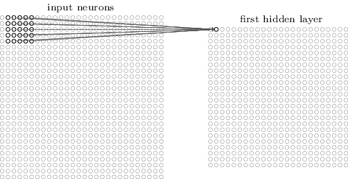
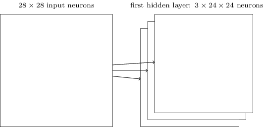
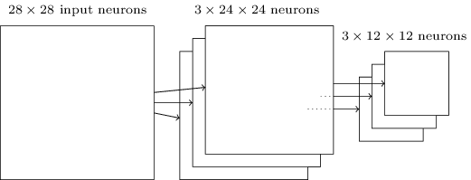

<!-- _class: lead invert -->

# Convolutional Neural Networks

---

### Fully Connected Networks

- The simplest form of neural networks.
- Each neuron in one layer is connected to every neuron in the next layer.
- Training is expensive and prone to overfitting!
- It does not take advantage of the spatial structure of images!

---

## Convolutional Neural Networks

- **Convolutional Neural Networks (CNNs)** are a type of neural network that is designed to recognize visual patterns directly from pixel images.
- They have three main components:
  1. Local receptive fields
  2. Shared weights
  3. Pooling

---

## Thinking About the Layers Differently

- In a fully connected network, we think of each layer as a vector of neurons.
- In a CNN, we think of each layer as a 2D matrix or 3D volume of neurons.
- 784 $\rightarrow$ 28x28x1
  (or 28x28x3 if RGB)

---

---

### Local Receptive Fields

- **Local receptive fields** are small windows that move across the input image.
- Each window connects to a neuron in the next layer.
- This allows the network to capture spatial information.

---

## Shared Weights

- Instead of learning a separate set of weights for each neuron, CNNs learn *a single set of weights that are shared across all neurons within a layer*.
- All neurons in a layer detect the same feature, but at different locations in the input image.
- To look for multiple features at once, *we add layers to our layers*!

---

## Pooling

- **Pooling** is a technique used to reduce the spatial dimensions of the input.
- For example, max pooling takes the maximum value from a small window and passes it to the next layer.
- Think of this like downsizing an image!

---

---

<!-- _class: lead -->
# Exercise

# `https://shorturl.at/GRzFo`