# Thursday, July 11th
- Recurrent Neural Networks
- Long Short-Term Memory
- Language Models

## But First
- Fill out the Survey!

---

<!-- _class: lead invert -->

# Let's Recap

---

## Perceptrons

- **Perceptron**: A simple model of a neuron.
- **Inputs**: Multiple binary inputs.
- **Output**: Single binary output.
- **Weights**: Each input is assigned a weight.
- **Activation**: Sum of weighted inputs compared to a threshold.

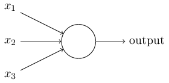

---

## Activation Function

- If the weighted sum exceeds the threshold, $b$, the output is 1.
- Otherwise, the output is 0.

$$
\begin{eqnarray}
w = \begin{bmatrix} 
w_1 \\ 
w_2 \\ 
\vdots \\ 
w_n 
\end{bmatrix}
x = \begin{bmatrix} 
x_{11} \\ 
x_{21} \\ 
\vdots \\ 
x_{n1} 
\end{bmatrix} 
\rightarrow \quad
  \mbox{output} = \left\{ 
    \begin{array}{ll} 
      0 & \mbox{if } w\cdot x + b \leq 0 \\
      1 & \mbox{if } w\cdot x + b > 0
    \end{array}
  \right.
\end{eqnarray}
$$

---

$$
\rightarrow
$$

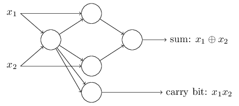

---

## Sigmoid Neurons

- **Sigmoid Neuron**: Similar to perceptron but with a sigmoid activation function.
- **Activation Function**: Sigmoid function:

$$
\begin{eqnarray}
w = \begin{bmatrix}
w_1 \\
w_2 \\
\vdots \\
w_n
\end{bmatrix}
x = \begin{bmatrix}
x_{11} \\
x_{21} \\
\vdots \\
x_{n1}
\end{bmatrix}
\rightarrow \quad
  \mbox{output} = \sigma(w\cdot x + b)
\end{eqnarray}
$$

---

## Neural Networks

- **Neural Network**: A collection of neurons organized in layers.
- **Layers**:
    - Input Layer
    - Hidden Layer(s)
    - Output Layer

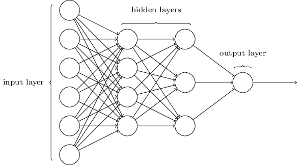

---

## Convolutional Neural Networks

- Designed to recognize visual patterns directly from pixel images.
- Three new components:
  1. Local receptive fields
  2. Shared weights
  3. Pooling

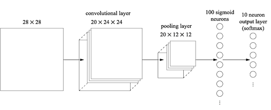

---

### Local Receptive Fields

- **Local receptive fields** are small windows that move across the input image.
- Each window connects to a neuron in the next layer.
- This allows the network to capture spatial information.

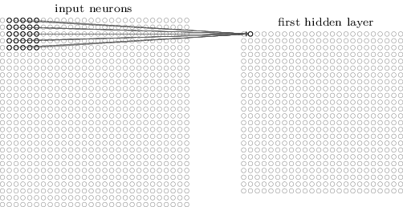

---

## Shared Weights

- Instead of learning a separate set of weights for each neuron, CNNs learn *a single set of weights that are shared across all neurons within a layer*.
- All neurons in a layer detect the same feature, but at different locations in the input image.
- To look for multiple features at once, *we add layers to our layers*!

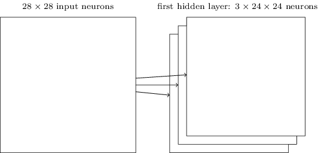

---

## Pooling

- **Pooling** is a technique used to reduce the spatial dimensions of the input.
- For example, max pooling takes the maximum value from a small window and passes it to the next layer.
- Think of this like downsizing an image!

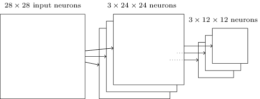

---

# Exercise 
# `https://shorturl.at/bhlPz`

---

<!-- _class: lead invert -->

# Recurrent Neural Networks

---

## Feedforward Neural Networks

- **Feedforward Neural Networks (FNNs)**: Simple networks where information moves in one direction, from input to output.
- **Limitation**: Do not capture spatial or sequential dependencies well.

To process text, audio, or time series data, we need a different type of network.

---

---

## Recurrent Neural Networks (RNNs)

- **Purpose**: Designed to handle sequential data by maintaining a hidden state.
- **Architecture**:
  - Output from the previous step is fed as input to the current step
  - Hidden state: $h_t = f(W_h h_{t-1} + W_x x_t + b)$
- **Applications**: Language modeling, time series prediction, speech recognition, anything with an order and variable length.

---

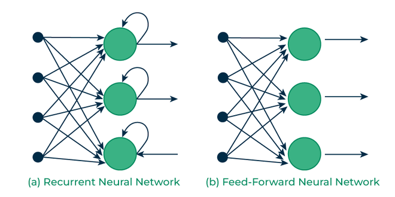

---

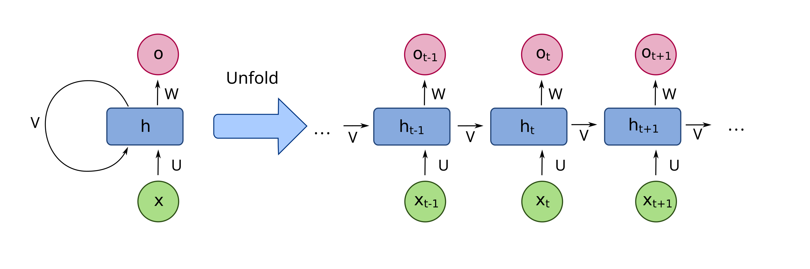

---

## Vanishing and Exploding Gradients

- **Vanishing Gradients**: Gradients become too small, preventing the network from learning long-term dependencies.
- **Exploding Gradients**: Gradients become too large, causing instability in training.
- **Impact**: Limits the effectiveness of standard RNNs for long sequences.

---

## Long Short-Term Memory (LSTM)

- **Solution**: LSTMs introduce gates to control the flow of information, addressing the vanishing gradient problem.
- **Architecture**:
  - **Forget Gate**: Decides what information to discard.
  - **Input Gate**: Decides what new information to store.
  - **Output Gate**: Decides what information to output.
- **Benefits**: Capable of learning long-term dependencies.

---

- The intuition behind the LSTM architecture is to create an additional module in a neural network that learns when to remember and when to forget pertinent information.

- In the sentence:
  > <mark>Dave</mark>, as a result of <mark>his</mark> controversial claims, <mark>is</mark> now a pariah
  
  An LSTM might remember "Dave" and the be able to connect that to "his" and "is" to understand the sentence.

---

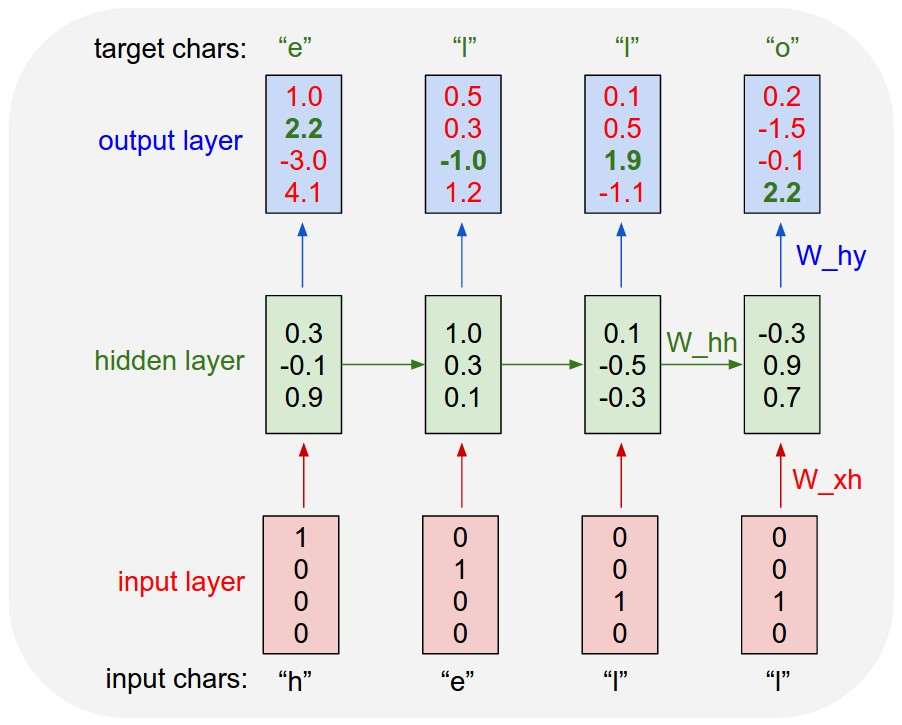

---

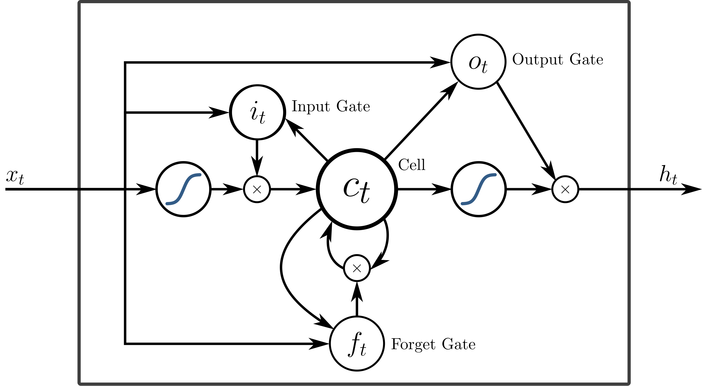

