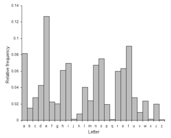

<!-- _class: lead invert -->

# Generating Text w/ LLMs


---

## Recap on Generating Text w/ Markov Chains

```python
# Step 1: Initialize a list of words
word_list = [
    "the", "cat", "in", "the", "hat", "the", "cat", "on", "the", "mat",
    "the", "dog", "and", "the", "cat", "the", "cat", "and", "the", "hat"
]
```

---

```python
# Step 2: Calculate the transition probabilities
transitions = {}

# Populate the transitions dictionary with counts
for i in range(len(word_list) - 1):
    current_word = word_list[i]
    next_word = word_list[i + 1]
    if current_word not in transitions:
        transitions[current_word] = {}
    if next_word not in transitions[current_word]:
        transitions[current_word][next_word] = 0
    transitions[current_word][next_word] += 1

# Convert counts to probabilities
for current_word, next_words in transitions.items():
    total = sum(next_words.values())
    for next_word in next_words:
        transitions[current_word][next_word] /= total
```

---

```python
# Step 3: Build a way to generate new sequences based on transitions
def next_word(current_word):
    if current_word not in transitions:
        return random.choice(list(transitions.keys()))
    probabilities = transitions[current_word]
    next_words = list(probabilities.keys())
    probabilities = list(prbabilities.values())
    return random.choices(next_words, probabilities)[0]

def generate_sequence(start_word, length):
    sequence = [start_word]
    current_word = start_word
    for _ in range(length - 1):
        current_word = next_word(current_word)
        sequence.append(current_word)
    return sequence
```

---

```python
start_word = "the"
length = 20
sequence = generate_sequence(start_word, length)
print("Generated sequence:", sequence)
```
```
Generated sequence: [
    'the', 'mat', 'the', 'cat', 'on', 'the', 
    'hat', 'the', 'cat', 'the', 'cat', 'and', 
    'the', 'mat', 'the', 'hat', 'the', 'mat',
    'the', 'cat'
]
```

---

## Recap on the Output Layer

- The output layer of a neural network is a vector of probabilities.
- In the case of MNIST:
    - Out: [0, 1, 2, 3, ..., 9]
- In the case of cat-dog:
    - Out: ["cat", "dog"]
- What if we trained an LSTM on the next letter of a text?
    - Out: ["a", "b", "c", ..., "z"]



---

## Choosing the Next value

- The simplest way to choose the next value is to use the `argmax` function of the output layer.
- We can also use a sampling method to introduce randomness, which we'll call "temperature".
    - The higher the temperature, the more random the output.

---

# Exercise

# `https://shorturl.at/gF87d`