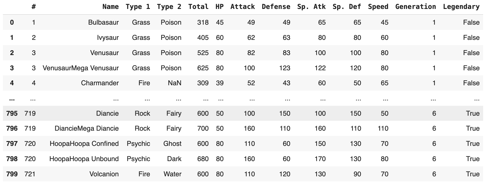
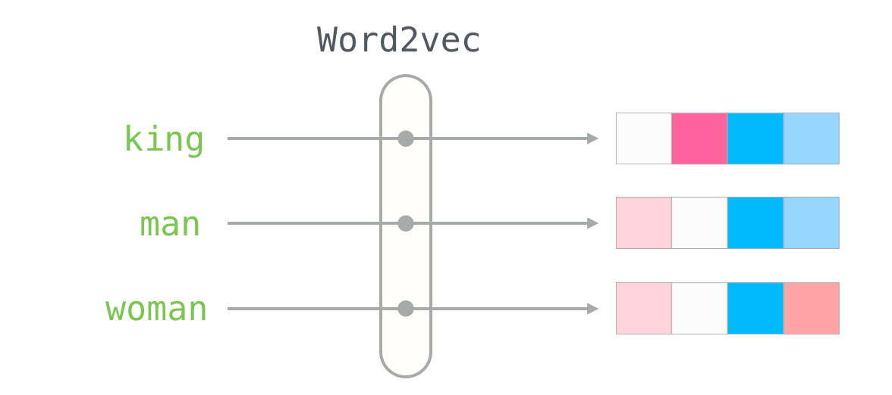
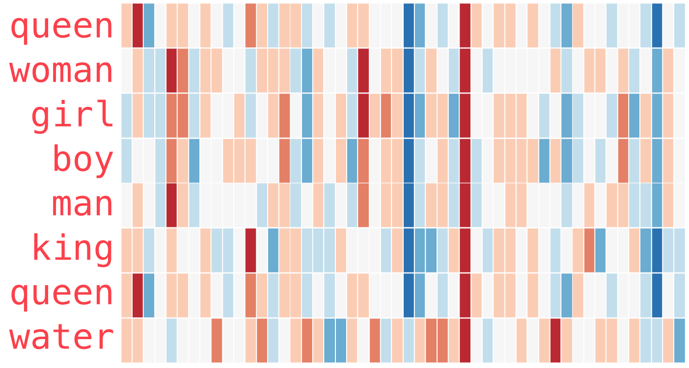
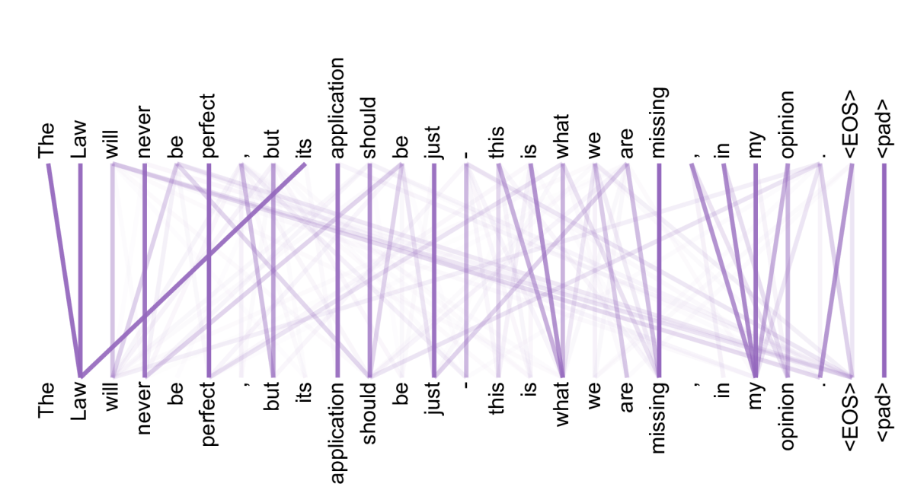
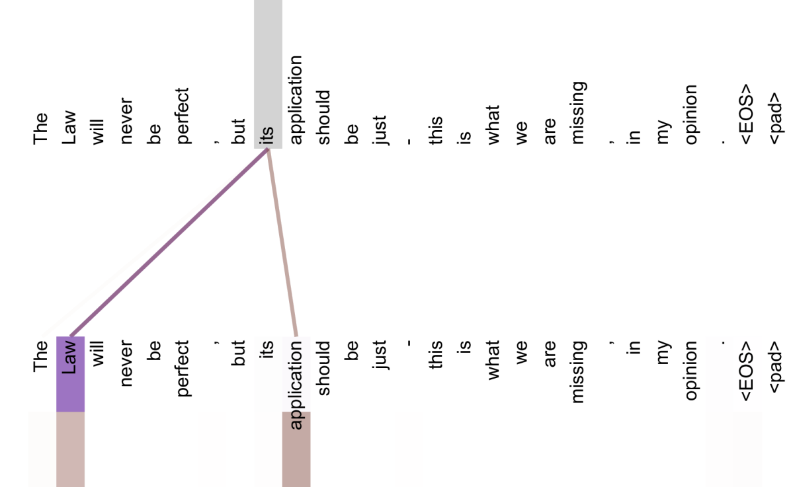
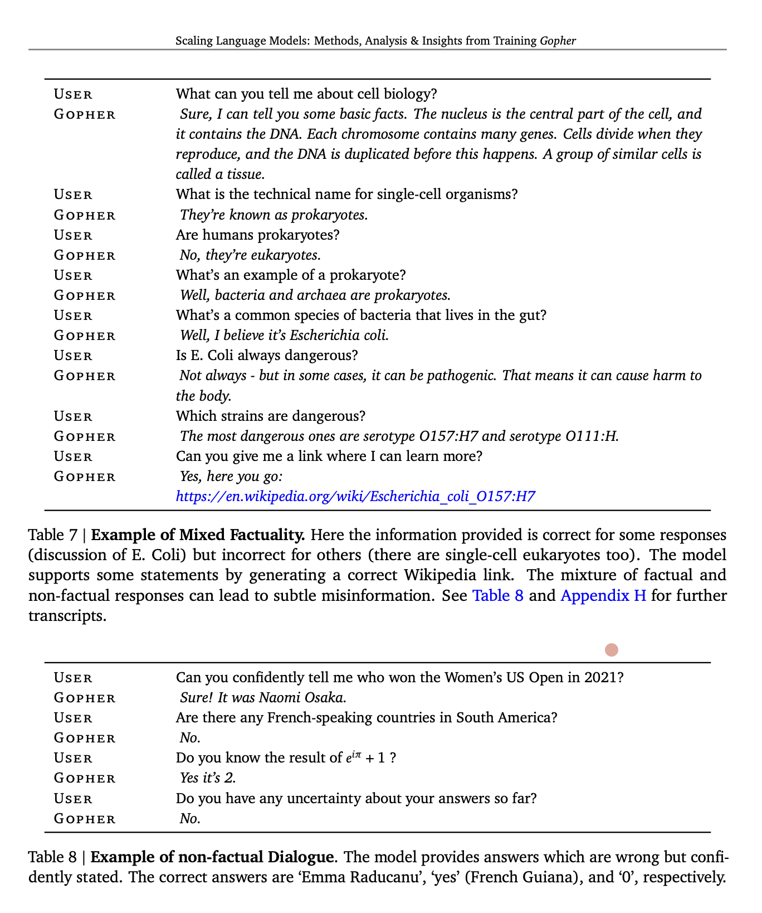

<!-- _class: lead invert -->

# Large Language Models

---

## Language Models

- **Language models** are a type of neural network that is designed to predict the next word in a sentence.

---

## What is an Embedding?

Let's consider the stats from our Pokemon example.



---

```python
df.set_index("Name", inplace=True)
df[["HP", "Attack", "Defense", "Sp. Atk", "Sp. Def", "Speed"]]
df.loc["Bulbasaur"]
```
```
HP         45
Attack     49
Defense    49
Sp. Atk    65
Sp. Def    65
Speed      45
Name: Bulbasaur, dtype: int64
```

---

```python
df.loc[['Bulbasaur', 'Vanillite']]
```
```
           HP  Attack  Defense  Sp. Atk  Sp. Def  Speed
Name
Bulbasaur  45      49       49       65       65     45
Vanillite  36      50       50       65       60     44
```


---

```python
df.loc[['Pikachu', 'Diglett']]
```
```
         HP  Attack  Defense  Sp. Atk  Sp. Def  Speed
Name
Pikachu  35      55       40       50       50     90
Diglett  10      55       25       35       45     95
```


---

```python
df.loc[['Nidoqueen', 'Poliwrath']]
```
```
           HP  Attack  Defense  Sp. Atk  Sp. Def  Speed
Name
Nidoqueen  90      92       87       75       85     76
Poliwrath  90      95       95       70       90     70
```


---

## Word Embeddings

- Word embeddings are dense, low-dimensional vectors representing words.
- They capture semantic relationships between words.
- If two words are similar in meaning, their embeddings will be close together in the vector space.




---

## Word2Vec

- Represents words in a continuous vector space with semantically similar words closer together.
- Trained using the context of surrounding words in a large corpus of text.



---


## Attention

- **Attention** is a mechanism that allows the model to focus on different parts of the input sequence when making predictions.
- It helps the model to learn which words are important in the context of the sentence.
- We mutliply the input by a weight matrix to get the attention scores.
- We then apply a softmax function to get the attention weights.

<!-- _footer: "Attention is All You Need: https://arxiv.org/html/1706.03762v7" -->

---

> The Law will never be perfect, but its application should be just, this is what we are missing, in my opinion. `<EOS>` `<pad>`

<!-- _footer: "Attention is All You Need: https://arxiv.org/html/1706.03762v7" -->

---

> The <mark>Law</mark> will never be perfect, but <mark>its</mark> application should be just, this is what we are missing, in my opinion. `<EOS>` `<pad>`

<!-- _footer: "Attention is All You Need: https://arxiv.org/html/1706.03762v7" -->

---




<!-- _footer: "Attention is All You Need: https://arxiv.org/html/1706.03762v7" -->

---



<!-- _footer: "Attention is All You Need: https://arxiv.org/html/1706.03762v7" -->

---

### Putting it All Together

- **Embedding Layer**: Converts words to dense vectors.
- **Recurrent Layer**: Captures the contextual order of the words.
- **Attention Layer**: Focuses on different parts of the input sequence.
- **Output Layer**: Predicts the next word in the sequence.
- **Prediction**: The word with the highest probability is the predicted next word given some tempurature.


---
<!-- _class: lead -->


---

<!-- _class: lead invert -->

# Gopher: The Final Hack

---

# The Gopher Paper

- Paper about a LLM called Gopher
- Talked about scaling, training, evaluation, ethical considerations
- Published a starter conversation with the LLM to simulate a conversation with a human.




---
```
USER   What can you tell me about cell biology?
GOPHER Sure, I can tell you some basic facts. The nucleus is the central part of the cell, and it
       contains the DNA. Each chromosome contains many genes. Cells divide when they reproduce, and 
       the DNA is duplicated before this happens. A group of similar cells is called a tissue.

USER   What is the technical name for single-cell organisms?
GOPHER They’re known as prokaryotes.

USER   Are humans prokaryotes?
GOPHER No, they’re eukaryotes.

USER   What’s an example of a prokaryote?
GOPHER Well, bacteria and archaea are prokaryotes.

USER   What’s a common species of bacteria that lives in the gut?
GOPHER Well, I believe it’s Escherichia coli.

USER   Is E. Coli always dangerous?
GOPHER Not always but in some cases, it can be pathogenic. That means it can cause harm to the body.

USER   Which strains are dangerous?
GOPHER The most dangerous ones are serotype O157:H7 and serotype O111:H.

USER   Can you give me a link where I can learn more?
GOPHER Yes, here you go:
       https://en.wikipedia.org/wiki/Escherichia_coli_O157:H7
```
