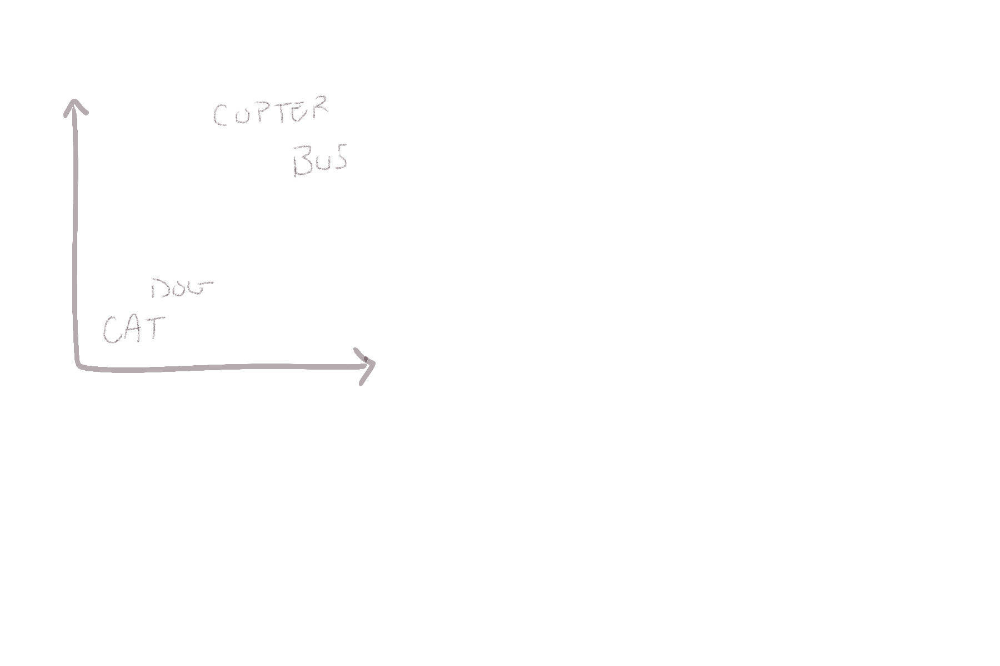

# Friday, July 12th
- Langchain and more on LLMs
- Stable Diffusion
- Academics and Jobs in Data Science
- Ethics
- ???

# Exercise
# `https://shorturl.at/DIVJQ`

---

<!-- _class: lead invert -->

# LangChain

---

## Overview

LangChain is a framework for developing applications powered by language models. It wraps LLM and vector store/retrieval APIs in a modular architecture.

It integrates with both local and cloud-based language models, but makes them easy to swap out.

---

## Components

- `langchain` - the main package
- `langchain-community` - third party integrations that are maintained by the LangChain community.
- `langgraph` - extension of LangChain that lets you build graph-like execution flows such as multi-agent systems.

- `langserve` - a way to wrap the language model in a REST API.

---

## Neat Featurs

- Chat History - store and retrieve chat history with a language model done through LangChain.
- Document Handling and Loading - load and handle documents in a language model, useful for RAG models.
- Interface with Vector Stores - store and retrieve vectors from a vector store.
- Caching - cache responses from the language model.

---

## Structure Data Generation

```python
from langchain_core.pydantic_v1 import BaseModel, Field

class Joke(BaseModel):
    setup: str = Field(description="The setup of the joke")
    punchline: str = Field(description="The punchline to the joke")
    rating: int|None = Field(description="How funny the joke is, from 1 to 10")

structured_llm = llm.with_structured_output(Joke)
structured_llm.invoke("Tell me a joke about cats")
``` 
```
Joke(
    setup='Why was the cat sitting on the computer?',
    punchline='To keep an eye on the mouse!',
    rating=None,
)
```

---

## Retrieval Augmented Generation (RAG)

- RAG is a technique for augmenting LLM knowledge with additional data.
- Three Stages:
    - Indexing: Ingesting documents, breaking them up, and indexing them by their embeddings.
    - Retrieval: Retrieving relevant documents and passing them into the context of the LLM.
    - Generation: Generating a response based on the context.

---


---


---

## Text-to-SQL

- SQL is a language for querying databases (tables).
- Text-to-SQL is a task where you convert a natural language question into an SQL query.
- Part of your RAG may be to convert a natural language question into an SQL query and then load those results into the LLM.
- Could also be Text-to-Cypher (aweful graph database language) or a custom query language (*Someone in my office is working on this as we speak*).

---

<!-- _class: lead invert -->

# Some Old-Man Thoughts About Using LLMs

---

## In Coding

- Mr. P started his carreer using Vim and no tools.
- Now he uses:
    - VSCode (with Vim-keybindings)
    - A static linter
    - A static type-checker
    - A formatter
    - An LLM copilot


---

## In Coding

- **Strong fundamentals and experience writing code will get you further than memorizing a library.**
- LLM-driven Strategies
    - Comment-driven coding
    - Use simple frameworks the LLM can fit in context (Flask, HTMX, AlpineJS)


---

## Embrace Plain Text
- Markdown for documents
    - Bear, Obsidian, Mkdocs
- Latex for math

$$
\text{MSE} = \frac{1}{n} \sum_{i=1}^{n} \left( y_i - \hat{y}_i \right)^2
$$

$$
\text{MSE} = \frac{1}{n} \left( \mathbf{y} - \hat{\mathbf{y}} \right)^\top \left( \mathbf{y} - \hat{\mathbf{y}} \right)
$$


---

<!-- _class: lead invert -->

# Discussion
How are you going to use LLMs in your work and education?

---

<!-- _class: lead invert -->

# Image Generation


---

- 2015 Resarchers at UofT created a neural network that could generate images called AlignDRAW.
- Training requires a dataset of images labeled with text captions.
- The model learns to generate back to the images from the text captions.

> a stop sign is flying in blue skies


---

- The model has three stages
    - **Text Encoder**: Encodes the text caption into a vector.
    - **Generator**: Generates the image from the text vector.
    - **Diffusion**: Refines the image to make it more realistic.
- Most commercial image generation models have a last step saftey filter.


---

<!-- _class: light -->



---

<!-- _class: light -->


---

<!-- _class: light -->


---

<!-- _class: light -->


---

<!-- _class: light -->


---

## Diffusion

- Diffusion is model for refining images.
- **Training**: They model is trained by taking real images, adding noise to, them and then training the model to remove the noise.
- **Inference**: The model is then used to refine the generated images into more realistic images.

---

## Text-to-Image Generation

Text-to-Image: Generating an image purely from a text prompt.

### Process:
- Input a descriptive text prompt.
- The model generates an image that matches the description.

### Example:
> A futuristic city skyline at sunset

---

## Text and Image-to-Image Generation

**img2img:** Generating an image using both a text prompt and a base image.

## Process:

- Input a descriptive text prompt and a base image.
- The model refines and transforms the base image according to the text prompt.

## Example:

A sketch of a cat turned into a realistic cat

---

$$
\rightarrow
$$


---

## DreamBooth

A fine-tuning technique for personalized image generation.

### Purpose

Customize the model to generate images of specific subjects, such as a person's face or a particular object.

### Process

- Collect a few images of the subject.
- Fine-tune the model on these images.
- Generate new images featuring the subject in various scenarios.

---


---

## LoRAs (Low-Rank Adaptation)
A technique to adapt a pre-trained model to new tasks with minimal data and computational resources.

### Purpose

Enable efficient fine-tuning and adaptation without retraining the entire model. Popular for training "styles".

### Process

- Insert low-rank adapters into the model layers.
- Train only the adapters while keeping the original model weights frozen.

---


<!-- _footer: civitai.com -->

---

# Exercie

<!-- # `https://shorturl.at/e11r3` -->
# `https://shorturl.at/0MNRC`

## Img2Img
## `https://shorturl.at/66Hx0`

---

<!-- _class: lead invert -->

# What Can we Predict About the Future of AI 

---


---


---


---

<!-- _class: lead invert -->

# Carreers in and Around Data Science and Machine Learning

---


---

## Software Engineer

- The broadest career label
- Develops, tests, maintains software.
- Usually subdivided into groups:
    - frontend/backend
    - product/infrastructure
- Stakeholders are customers or internal.
- Overlaps with every other role.


---

## Software Engineer

#### Salary
$128K - $253K
<small>(Levels.fyi, 25th to 75th)</small>

#### Education
- Bachelor's in Computer Science
- Lots of self-taught engineers


---

## Data Engineer

- Designs, builds, and maintains data pipelines.
- Responsible for data models and maintaing datasets and data lifecycles.
- Works closely with data scientists and analysts.
- Stakeholders are usually technical-internal.
- Overlaps most w/ SE and MLE.


---

## Data Engineer

#### Salary
$128K - $253K
<small>(Levels.fyi, 25th to 75th)</small>

#### Education
- Some have a degree in Computer Science or Data Science
- Some get certifications


---

## Machine Learning Engineer

- Develops and deploys machine learning models.
- Monitors and maintains model performance.
- Often responsible for "productionizing" models.
- Stakeholders are technical-internal or business KPIs.
- Overlaps most with DE and DS.


---

#### Salary
$128K - $253K
<small>(Levels.fyi, 25th to 75th)</small>

#### Education
- Some have a degree in Computer Science or Data Science
- Some get certifications


---

## Data Scientist

- Analyzes and interprets data to derive insights.
- Often responsible for creating visualizations.
- Does exploratory data analysis.
- Communicates findings to stakeholders.
- Lots of possible stakeholders.
- Overlaps with MLE, DE, and BA.


---

## Data Scientist

#### Salary
$125K - 222K
<small>(Levels.fyi, 25th to 75th percentile)</small>

#### Education
- Some have a Bachelors or Masters in CS or Statistics
- **Most** are PhD academic-converts


---

## Business Analyst

- Analyzes data to inform business decisions.
- Often responsible for creating reports.
- Stakeholders are almost always non-technical internal.
- Often a domain expert.
- Overlaps with DS and DE.


---

## Business Analyst

#### Salary
$87K - $145K
<small>(Levels.fyi, 25th to 75th percentile)</small>

#### Education
- Some have a degree in Business or Economics
- Some have a degree in Data Science


---

## Research Scientist

- Conducts in-depth research and experiments in a specific field or discipline.
- Collects and analyzes data to test hypotheses.
- Publishes findings in academic journals or presents at conferences.
- Stakeholders are their grants.
- Overlaps with DS and MLE.


---

## Research Scientist

#### Salary
???

#### Education
- PhD in a specific field
- Often post-docs


---

## Kinds of Workplaces

| Type | Salary | Vibe | Job Security | Scope of Work |
|------|--------|------|--------------|---------------|
| Big Tech | High | Competitive | Good | Limited |
| Startups | Low | Exciting | Poor | Broad |
| Academia | Low | Intellectual | Good | Deep |
| Banks | High | Conservative | Good | Limited |
| Government | Low | Bureaucratic | Good | Broad |

---

## Fields That Use Data Science

<div class="columns">

  <div>

- Manufacturing
- Finance
- Molecular Biology
- Healthcare
- Supply Chain
- Journalism

</div>

<div>

- Education
- Legal Services
- Sales
- Environmental Science
- Marine Biology 
- Public Policy

</div>

</div>

---

## SealNet: CNNs to Detect Antarctic Seals

- **Objective:** Detect and count Antarctic pack-ice seals using satellite imagery.
- **Importance:** Seals are key predators in the Southern Ocean ecosystem, and understanding their population sizes helps predict ecosystem responses to threats like climate change and krill fishing.

<!-- _footer: https://www.sciencedirect.com/science/article/abs/pii/S0034425719306376 -->

---

- Use Worldview-3 satellite imagery.
- Develop a Convolutional Neural Network (CNN) to detect and locate seal centroids.
- Combines semantic segmentation heatmaps with binary classification. (?)
- Uses regression for counting.

<br>

- Locates over 30% of seals compared to human expert counts.
- Reduces detection time by 95% vs human.

<!-- _footer: https://www.sciencedirect.com/science/article/abs/pii/S0034425719306376 -->

---

<!-- _class: lead -->

> I’m a mediocre cartoonist, a mediocre writer, and a mediocre businessperson. But I’m a combination of all three, and the intersection of mediocrity makes me successful.


---

<!-- _class: lead -->

> Programming as a profession is only moderately interesting. It can be a good job, but if you want to make about the same money and be happier you could actually just go run a fast food joint. You are much better off using code as your secret weapon in another profession.
**~ Zed Shaw (Learn Python the Hard Way)**

---

<!-- _class: lead invert -->

# What to Study

---

# Math

- Calculus 1, 2
- **Linear Algebra**
- Graph Theory
- Abstract Algebra

---

## Statistics
- **Probability Theory**
- Statistical Inference
- Regression Analysis
- Elementary Stockastic Processes
- Time Series Analysis

---

## Computer Science

- **Data Structures**
- Algorithms
- Databases
- Computer Architecture
- Operating Systems

---

<!-- _class: lead -->

# Build Stupid Shit!

---

## Having Side-Projects

- Practice programming by building things you enjoy!
- Learn to use the related languages/tools.
- Learn to use the terminal and run python scripts
- Pick a favorite code editor:
    - VSCode
    - Pycharm
    - Vim/Emacs
- Pick projects that are small and achievable.
- **Sign up for Github** and learn git!

---

## Build Stupid Web Apps

- Python is an easy language to deploy as the backend to a web-site
- Popular libraries are:
    - Flask ❤️
    - FastAPI
    - Django.
- You'll need to learn some HTML/CSS/JS but that's a good thing! Just keep it simple.
- I like render.io for deployment

---


<!-- _footer: https://peticol.as/coronavirus-calculator/ -->

---


<!-- _footer: https://peticol.as/insurance-calculator/ -->

---


<!-- _footer: 12seasons.nyc -->

---

## Build Games

- Building games will make you good at programming and applying math.
- Build Javascript games w/ HTML-Canvas
- Start small, check out fantasy consoles:
    - PICO-8 (LUA) ❤️
    - Pyxel (Python)
    - Tic-80 (Variable)


---

## Use LLMs in Your Projects


---

# What Did We Learn?

- Google Colab
- Python Operators
- Python Conditionals
- Python Loops
- Python Functions
- Python Data Primitive and Structures
- Python Lists
- Python Dicts

---

# What Did We Learn?

- Nested Python Data Structures
- Python Modules
- Pandas
- Loading and Handling a Data Set
- Statistics for Data
    - Mean, Median, Percentiles, Quauntiles, Standard Deviation
- Data Visualization
- What is a Model?

---

# What Did We Learn?

- Markov Chains
- Natural Language Processing
    - BoW
    - TFIDF
    - Word2Vec
    - Sentiment Analysis
- Machine Learning
- SKLearn

---

# What Did We Learn?

- Linear Regressions
- Logistic Regressions
- Decision Trees
- Feature Engineering
- K-Means Clustering
- Neural Networks
- Convolutional Neural Networks
- Recurrent Neural Networks (and LSTMs)

---

# What Did We Learn?

- LLMs and Generating Text
- LangChain
- Image Generation

---

<!-- _class: lead invert -->

# The Data Science Oath

---

I swear to fulfill, to the best of my ability and judgment, this covenant:

I will respect the hard-won scientific gains of those data scientists in whose steps I walk and gladly share such knowledge as is mine with those who follow.

I will apply, **for the benefit of society,** all measures which are required, **avoiding misrepresentations** of data and analysis results.

I will remember that **there is art to data science** as well as science and that consistency, candor, and compassion should outweigh the algorithm's precision or the interventionist's influence.

---

**I will not be ashamed to say, “I know not,”** nor will I fail to call in my colleagues when the skills of another are needed for solving a problem.

**I will respect the privacy of my data subjects**, for their data are not disclosed to me that the world may know, so I will tread with care in matters of privacy and security. If it is given to me to do good with my analyses, all thanks. But it may also be within my power to do harm, and this responsibility must be faced with humbleness and awareness of my own limitations.

---

**I will remember that my data are not just numbers without meaning or context, but represent real people and situations**, and that **my work may lead to unintended societal consequences**, such as inequality, poverty, and disparities due to algorithmic bias. My responsibility must consider potential consequences of my extraction of meaning from data and ensure my analyses help make better decisions.

I will perform personalization where appropriate, but **I will always look for a path to fair treatment and nondiscrimination.**

---

I will remember that **I remain a member of society, with special obligations to all my fellow human beings**, those who need help and those who don't.

If I do not violate this oath, may I enjoy vitality and virtuosity, respected for my contributions and remembered for my leadership thereafter. May I always act to preserve the finest traditions of my calling and may I long experience the joy of helping those who can benefit from my work.


---

**Thank you for your hard work!**

### Slides and Notebooks
  - ### `shorturl.at/XUJtU`
  - ### `github.com/x/columbia-bigd103-2024`

### Contact Me
  - ### `devon@peticol.as`